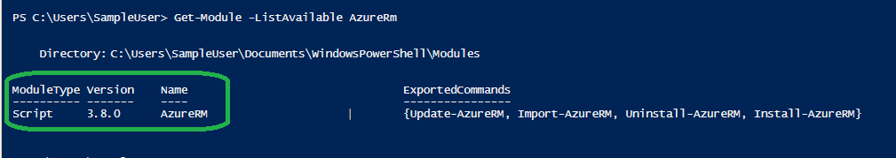

# Installation Guide

**Release Version: 2.1.xx**  
>**Pre-requisites**: PowerShell 5.0 or higher. Azure PowerShell 3.8.0. Azure Powershell 4.0 currently not supported.

	
1. First verify that prerequisites are already installed:  
   1. Ensure that you have PowerShell version 5.0 or higher. (In the PowerShell ISE console window, type **$PSVersionTable** and look at PSVersion.) If it is older, you should update PS from [here](https://www.microsoft.com/en-us/download/details.aspx?id=54616).  
   

   2. Confirm that you have Azure PowerShell modules by verifying the presence of a representative module using the following command:  
    ```PowerShell
	Get-Module -ListAvailable AzureRm 	
    ```
     The output should look like below (version for AzureRM should be 3.8.0 as shown in below image):  
     
   

2. Install the AzSDK security PS module:  
	  
```PowerShell
  Install-Module AzSDK -Scope CurrentUser
```

Use `-AllowClobber` and `-Force` option if you are already having a different version of AzureRM installed on your machine

>**Note:** Currently AzSDK doesn't work with AzureRM 4.0 or greater. We are working towards that. Until then you need to have AzureRM 3.8 and it can co-exist with AzureRM 4.0.

