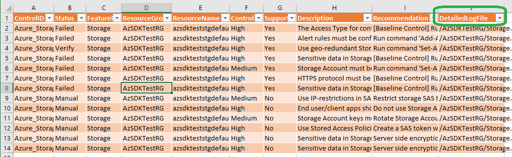

# Addressing Control Failures
### Contents

### [Introduction](Readme.md#introduction)

### [Automatically Generating Fixes](Readme.md#automatically-generating-fixes)
- [Overview](Readme.md#overview)  
- [How to generate fix script?](Readme.md#how-to-generate-fix-script)  
- [Understand 'FixControlScripts' folder](Readme.md#understand-fixcontrolscripts-folder)
- [How to run fix script generated by AzSDK?](Readme.md#how-to-run-fix-script-generated-by-azsdk)  
- [Repair-AzSDKSubscriptionSecurity](Readme.md#repair-azsdksubscriptionsecurity)  
- [Repair-AzSDKAzureServicesSecurity](Readme.md#repair-azsdkazureservicessecurity)  

### [Control Attestation](Readme.md#control-attestation-1)
- [Overview](Readme.md#overview-1)  
- [Starting attestation](Readme.md#starting-attestation)  
- [How AzSDK determines the effective control result](Readme.md#how-azsdk-determines-the-effective-control-result)  
- [Permissions required for attesting controls](Readme.md#permissions-required-for-attesting-controls)  
- [Bulk attestation](Readme.md#bulk-attestation)  
----------------------------------------------------------------

# Introduction

This section assumes that you have used the basic subscription and resource security scan commands from 
the Getting Started document. It focuses on what you can do next after you have run the scans. 

Recall that, once a manual scan completes, the CSV file in the output folder that is (auto-) opened 
provides a consolidated security report for all the resources that were evaluated in the scan. 

To actually improve the security of your application, you now need to look at each control's evaluation
details in the AzSDK scan results and understand what actions you need to take. 

There are **2 important components** in the scan results that can help:

  a) The control summary in the CSV file and
  b) The detailed evaluation info in the LOG file.

For each control that was evaluated for a specific resource, the control summary line from the CSV file 
provides information such as the control id, overall control status (result), control description, 
recommended fix and other control-related info.

For controls other than a result of 'Passed' you will typically need to take some action. For this, apart
from the 'Recommendation' field, additional control evaluation info present in the LOG file should be used.
This can ensure that you take the right next steps for a control in the context of the specific resource. 
For example, if you are getting a 'Failed' for an RBAC related control, the LOG file is where you will have
additional details such as which accounts were found that caused AzSDK to flag a failure.

You can use the 'DetailedLogFile' field to locate the LOG file where control evaluation info for each control 
is written by AzSDK. (This file can be different for different resources/resource groups.) 
See the image below:

  

For some controls, AzSDK can automatically generate scripts that can be run to address the control failures.
This can be done using the '-GenerateFixScript' flag in the scan commands. Whether AzSDK has support for
auto-generating the fix script for a control is represented by the 'SupportsAutoFix' column for that control.

Also, sometimes, you will need to complement or override AzSDK's control evaluation result with additional 
contextual knowledge. This is called 'Control Attestation' and is supported by the '-AttestControls' flag in the scan commands. 

The rest of this section explains these two capabilities in detail.


# Automatically Generating Fixes
### Overview
For several security controls, the fix required to remediate a control failure is automatable. The AzSDK supports this scenario through the 'FixControls' feature. 
For the controls where this feature is available, AzSDK has the ability to generate a 'control fix' script that the user can review and run to apply the fixes. For many controls, fix automation is not feasible because the workflow involved in fixing a control may be complex. As a result, this feature may not be available/applicable for all controls. 
The overall sequence when using this feature is as follows:
1. A user runs one of the AzSDK scan scripts with a flag requesting the AzSDK to generate a 'control fix' script.
2. Once the scan completes, the user can review the control fix script. 
3. The user can update a parameters file to provide input values for the fix script. This is required for controls where the fix/remediation requires input params to be supplied by the user (e.g., IP addresses, user alias, etc.)
4. The user runs the script to remediate the relevant controls
5. (Optionally) The user can rerun the scan to confirm that the target controls were indeed remediated.    

[Back to top...](Readme.md#contents)

### How to generate fix script?
The script to automatically implement the recommendation for a control can be generated by passing the *'GenerateFixScript'* switch to the following SVT commands:
```PowerShell
	Get-AzSDKAzureServicesSecurityStatus
	Get-AzSDKSubscriptionSecurityStatus
	Get-AzSDKControlsStatus
```

Upon completion of command execution, a folder 'FixControlScripts' will be created in output folder (only if one or more of the failed controls support automated fixing). 
> Note: This folder contains multiple files which are described in a README.txt file in the same folder.


Run the script 'RunFixScript.ps1' from folder 'FixControlScripts'.  

[Back to top...](Readme.md#contents)

### Understand 'FixControlScripts' folder
This section describes how to interpret the different files created when AzSDK cmdlets are executed with 'GenerateFixScript' parameter.
To implement the recommendations for controls,  
1. The user can review the PowerShell files under 'Services' folder.  
2. The user can update a parameters file (FixControlConfig.json) to provide input values for the fix script. This is required for controls where the fix/remediation requires input params to be supplied by the user (e.g., IP addresses, user alias, etc.).  
3. The user runs the script (RunFixScript.ps1) to remediate the relevant controls.  
4. (Optionally) The user can rerun the scan to confirm that the target controls were indeed remediated.  

The contents of the 'FixControlScripts' folder are organized as under:  
- *\RunFixScript.ps1* - The file which starts implementing the recommendations. The file typically contains repair command which uses the files from current folder.  
- *\FixControlConfig.json* - The file contains the configuration of controls along with mandatory/optional parameters which are required for implementing the fix for control.  
- *\Services* - The folder contains the PowerShell files which are used to implement the fix for control.  
	- *\\\<resourceType>.ps1* - The file contains PowerShell code to implement the fix for control. The file can be referred for review.  
- *\FixControlConfig-\<Timestamp>.json* - This file is generated when repair command is run. The file contains the input values provided by user while running the repair command. The file can be referred for review.

[Back to top...](Readme.md#contents)

### How to run fix script generated by AzSDK?
The recommendation for a control can be implemented automatically by using following commands:
```PowerShell
	Repair-AzSDKAzureServicesSecurity
	Repair-AzSDKSubscriptionSecurity 
```
These commands use the 'FixControlConfig.JSON' file from the 'FixControlScripts' folder for the set of controls to auto-remediate. They are described further below:  

### Repair-AzSDKSubscriptionSecurity
This command remediates the subscription security related controls using the automated fixing scripts generated by running the corresponding AzSDK scan command with the '-GenerateFixScript' flag.

|Parameter|Name|Description|
|----|----|----|
|ParameterFilePath |The full file path to 'FixControlConfig.json' (by default generated in sub-folder 'FixControlScripts' of the AzSDK scan command output folder).|Mandatory|
|ControlIds|The list of control ids for which fixes should be applied.|Optional|
|Force|Switch to bypass user consent of modifying Azure resources|Optional|  

For example,
```PowerShell
Repair-AzSDKSubscriptionSecurity -ParameterFilePath <ParameterFilePath>
```
### Repair-AzSDKAzureServicesSecurity 
This command remediates security controls for various Azure resources using the automated fixing scripts generated by running the corresponding AzSDK scan command with the '-GenerateFixScript' flag.

|Parameter|Name|Description|
|----|----|----|
|ParameterFilePath |The full file path of  'FixControlConfig.json' (by default generated in sub-folder 'FixControlScripts' of the AzSDK scan command output folder). |Mandatory |
|ResourceGroupNames	|The list of resource groups for which fixes should be applied. |Optional |
|ResourceTypes |The list of resource types for which fixes should be applied. E.g., Microsoft.Sql/servers. |Optional |
|ResourceTypeNames |The list of resource type names for which fixes should be applied. E.g., SQLDatabase. |Optional |
|ResourceNames |The list of resources for which fixes should be applied. |Optional |
|ControlIds |The list of control ids for which fixes should be applied. |Optional |
|Force |Switch to bypass user consent prompts when modifying Azure resources |Optional |

For example,
```PowerShell
Repair-AzSDKAzureServicesSecurity -ParameterFilePath <ParameterFilePath>
```
[Back to top...](Readme.md#contents)

# Control Attestation

> **Note**: Please use utmost discretion when attesting controls. In particular, when choosing to not fix a failing control, you are taking accountability that nothing will go wrong even though security is not correctly/fully configured. 
> </br>Also, please ensure that you provide an apt justification for each attested control to capture the rationale behind your decision.  

### Overview

The attestation feature empowers users to support scenarios where human input is required to augment or override the default control 
evaluation status from the AzSDK. These may be situations such as:

- the AzSDK has generated the list of 'Owners' or 'Contributors' for a resource but someone needs to have a look at the list and ratify that 
these are indeed the correct people, or
- the AzSDK has marked a control as failed. However, given the additional contextual knowledge, the application owner wants to ignore the control failure, or
- the AzSDK has marked a control as failed and the issue is a valid security concern. However, due to other constraints, 
the application owner wants to defer the fix for later and request a risk ack.

In all such situations, there is usually a control result that is based on the technical evaluation (e.g., Verify, Failed, etc.) that has to 
be combined with the user's input in order to determine the overall or effective control result. The user is said to have 'attested' such controls 
and, after the process is performed once, AzSDK remembers it and generates an effective control result for subsequent control scans _until_ there 
is a state change.

The attestation feature is implemented via a new switch called *AttestControls* which can be specified in any of the standard security scan cmdlets
of the AzSDK. When this switch is specified, the AzSDK first performs a scan of the target resource(s) like it is business as usual and, once
the scan is complete, it enters a special interactive 'attest mode' where it walks through each resource and relevant attestable controls
and captures inputs from the user and records them in the subscription (along with details about the person who attested, the time, etc.). 
After this, for all future scans on the resource(s), AzSDK will show the effective control evaluation results. Various options are provided to support
different attestation scenarios (e.g., expiry of attestations, edit/change/delete previous attestations, attest only a subset of controls, etc.). 
These are described below. Also, for 'stateful' controls (e.g., "are these the right IP addresses to permit on the firewall?"), the attestation
state is auto-reset if there is any change in 'state' (e.g., someone added a new IP to the list).

Lastly, due to the governance implications, the ability to attest controls is available to a subset of subscription users. This is described in
the permissions required section below.  

<!-- TODO - Control Expiry --> 
 
[Back to top...](Readme.md#contents)
### Starting attestation
      
The AzSDK subscription and services scan cmdlets now support a new switch called *AttestControls*. When this switch is specified, 
AzSDK enters 'attest' mode immediately after a scan is completed. This ensures that attestation is done on the basis of the most current
control statuses.

All controls that have a technical evaluation status of anything other than 'Passed' (i.e., 'Verify' or 'Failed' or 'Manual' or 'Error') are considered 
valid targets for attestation.

To manage attestation flow effectively, 4 options are provided for the *AttestControls* switch to specify which subset of controls to target for attestation. These are described below:

|Attestation Option|Description|
|------------------|-----------|
|NotAttested|Attest only those controls which have not been attested yet.|
|AlreadyAttested|Attest those controls which have past attestations. To re-attest or clear attestation.|
|All|Attest all controls which can be attested (including those that have past attestations).|
|None|N/A.|

For example, to attest controls corresponding to a subscription security scan, run the command below:
```PowerShell  
$subscriptionId = <Your SubscriptionId>
Get-AzSDKSubscriptionSecurityStatus -SubscriptionId $subscriptionId -AttestControls NotAttested -DoNotOpenOutputFolder  
``` 
As shown in the images, the command enters 'attest' mode after completing a scan and does the following:

1. For each resource that was scanned, if a control is a target for attestation, control details (such as description, severity, etc.) and the current evaluation result are displayed (to help the user)
2. The user gets to choose whether they want to attest the control
3. If the user chooses to attest, attestation details (attest status, justification, etc.) are captured
4. This is repeated for all attestable controls and each resource.

 Sample attestation workflow in progress:
  
 
 Sample summary of attestation after workflow is completed:
  

Attestation details corresponding to each control (e.g., justification, user name, etc.) are also captured in the CSV file as shown below:
  

The attestation process for application resources is similar to that for subscriptions. For example, the command below shows how to 
trigger attestation for a specific resource in an RG:

```PowerShell  
$subscriptionId = <Your SubscriptionId>
$resourceGroupName = <ResourceGroup Name>
$resourceName = <ResourceName>
Get-AzSDKAzureServicesSecurityStatus -SubscriptionId $subscriptionId `
                -ResourceGroupNames $resourceGroupName `
                -ResourceName $resourceName `
                -AttestControls NotAttested `
                -DoNotOpenOutputFolder 
``` 
If, for any reason, the attestations of previously attested controls need to be revisited, it can be done by simply changing the 'NotAttested' flag in the commands above with 'AlreadyAttested'.  


[Back to top...](Readme.md#contents)
### How AzSDK determines the effective control result

During the attestation workflow, the user gets to provide attestation (sub)status for each control attested. This basically represents the user's attestation preference w.r.t.
a specific control (i.e., whether the user wants to override/augment the AzSDK status and treat the control as passed or whether the user agrees with the AzSDK status but wants to defer
fixing the issue for the time being):

|Attestation Status | Description|
|---|---|
|None | There is no attestation done for a given control. User can select this option duriung the workflow to skip the attestation|
|NotAnIssue | User has verified the control data and attesting it as not a issue with proper justification|
|WillNotFix | User has verified the control data and attesting it as not fixed with proper justification|
|WillFixLater | User has verified the control data and attesting it as not fixed with proper justification stating the future fix plan|


The following table shows the complete 'state machine' that is used by AzSDK to support control attestation. 
The columns are described as under:
- 'Control Scan Result' represents the technical evaluation result 
- 'Attestation Status' represents the user choice from an attestation standpoint
- 'Effective Status' reflects the effective control status (combination of technical status and user input)
- 'Requires Justification' indicates whether the corresponding row requires a justification comment
- 'Comments' outlines an example scenario that would map to the row

|Control Scan Result  |Attestation Status |Effective Status|Requires Justification |Comments |
|---|---|---|---|---|
|Passed |None |Passed |No |No need for attestation. Control has passed outright!|
|Verify |None |Verify |No |User has to ratify based on manual examination of AzSDK evaluation log. E.g., SQL DB firewall IPs list.|
|Verify |NotAnIssue |Passed |Yes |User has ratified in the past. E.g., SQL firewall IPs scenario, where all are IPs are legitimate.|
|Verify |WillNotFix |Exception |Yes |Valid security issue but a fix cannot be implemented immediately. E.g., A 'deprecated' account was found in the subscription. However, the user wants to check any dependecies before removal.|
|Verify |WillFixLater |Remediate |Yes |Valid security issue but a fix cannot be implemented immediately. E.g., A 'deprecated' account was found in the subscription. However, the user wants to check any dependecies before removal.|
|Failed |None |Failed |No |Control has failed but has not been attested. Perhaps a fix is in the works...|	 
|Failed |NotAnIssue |Passed |Yes |Control has failed but the issue is benign in a given context business. E.g., Failover instance for a non BC-DR critical service|
|Failed |WillNotFix |Exception |Yes |Control has failed. The issue is not benign but the user has some other constraint and cannot fix it. E.g., Need an SPN to be in Owner role at subscription scope.|
|Failed |WillFixLater |Remediate |Yes |Control has failed. The issue is not benign but the user wishes to defer fixing it for later. E.g., AAD is not enabled for Azure SQL DB.|
|Error |None |Error |No |There was an error during evaluation. Manual verification is needed and is still pending.|
|Error |NotAnIssue |Passed |Yes |There was an error during evaluation. However, control has been manually verified by the user.|
|Error |WillNotFix |Exception |Yes |There was an error during evaluation. Manually verification by the user indicates a valid security issue.|
|Error |WillFixLater |Remediate |Yes |There was an error during evaluation. Manually verification by the user indicates a valid security issue.|
|Manual |None |Manual |No |The control is not automated and has to be manually verified. Verification is still pending.| 
|Manual |NotAnIssue |Passed |Yes |The control is not automated and has to be manually verified. User has verified that there's no security concern.|
|Manual |WillNotFix |Exception |Yes |The control is not automated and has to be manually verified. User has reviewed and found a security issue to be fixed.|
|Manual |WillFixLater |Remediate |Yes |The control is not automated and has to be manually verified. User has reviewed and found a security issue to be fixed.|

  
<br>
The following table describes the possible effective control evaluation results (taking attestation into consideration).

|Control Scan Result| Description|
|---|---|
|Passed |Fully automated control. Azure resource/subscription configuration meeting the AzSDK control requirement|
|Verfiy |Semi-automated control. It would emit the required data in the log files which can be validated by the user/auditor.e.g. SQL DB IP ranges|
|Failed |Fully automated control. Azure resource/subscription configuration not meeting AzSDK control requirement|
|Error |Automated control. Currently failing due to some exception. User needs to validate manually|
|Manual |No automation as of now. User needs to validate manually|
|Exception |Risk acknowledged. The 'WillNotFix' option was chosen as attestation choice/status. |
|Remediate |Risk acknowledged with a remediation plan. The 'WillFixLater' option was chosen as attestation choice/status.|

[Back to top...](Readme.md#contents)
### Permissions required for attesting controls:
The attestation feature internally stores state in a storage account in a resource group called AzSDKRG. (This RG is also used by other features in the AzSDK for stateful scenarios.)
If this RG has already been created, then a user needs 'Owner' permission to it.
If this RG is not present (as is possible when none of the scenarios that internally create this RG have been run yet), then the user needs 'Owner' or 'Contributor' permission to the subscription.

> **Note**: The attestation data stored in the AzSDKRG is opaque from an end user standpoint. Any attempts to access/change it may impact correctness of security evaluation results.  


[Back to top...](Readme.md#contents)
### Bulk attestation

In some circumstances, you may have to perform attestation for a specific resource type across several instances. For instance,
you may have 35 storage accounts for which you need to perform attestation for one specific control. To do this one resource at
a time can be inefficient - especially if the reason for attesting the control is the same across all those resource instances. The
bulk attestation feature helps by empowering subscription/security owners to provide a common justification for a set of resources
all of which have a specific (single) controlId that requires attestation. This essentially 'automates' attestation by using 
a slightly different combination of parameters alongside '-AttestControls'.

 ```PowerShell  
$subscriptionId = 'sub_id_here'
$resourceGroupNames = 'Comma-separated list of RGs'
$resourceNames = 'Comma-separated list of resources'
$bulkAttestControlId = 'AzSDK ControlId string'     # You can get this from the CSV file, first column.
$justificationText = 'Rationale behind your choice of AttestationStatus here...'

Get-AzSDKAzureServicesSecurityStatus -SubscriptionId $subscriptionId `
                -ResourceGroupNames $resourceGroupName `
                -ResourceNames $resourceNames `
                -AttestControls NotAttested `
                -BulkAttestControlId $bulkAttestControlId `                 # ControlId to be attested
                -AttestationStatus <NotAnIssue | WillFixLater | WillNotFix> ` # Attestation choice/input, use one of these.
                -JustificationText $justificationText                   # Additional (text) justification
 
``` 
<br/>

|Parameter Name| Description|
|---|---|
|BulkAttestControlId | The controlId to bulk-attest. Bulk attest mode supports only one controlId at a time.|
|AttestControls | See table in the  [Starting Attestation](Readme.md#starting-attestatio) section. |
|AttestationStatus | Attester must select one of the attestation reasons (NotAnIssue, WillNotFix, WillFixLater)|
|JustificationText | Attester must provide an apt justification with proper business reason.|

To understand this better, let us take two example scenarios where bulk attestation can help,

###### Scenario 1: ######
The application uses multiple App Services where AAD authentication has been implemented through code. 
The control has been evaluated as 'Verify' by AzSDK because it cannot infer the status from the settings.

You know that for all these applications, AAD-authentication has been correctly implemented and want to 'Attest' that
control for all of them in a single pass. 

In this scenario, bulk attestation can be used as below to 'attest' the ControlId 'Azure_AppService_AuthN_Use_AAD_for_Client_AuthN' 
for all App Service objects: 

```PowerShell  
$subscriptionId = 'Your SubscriptionId'
$resourceNames = 'Comma-separated list of AppService names' 
$bulkAttestControlId = 'Azure_AppService_AuthN_Use_AAD_for_Client_AuthN'
$justificationText = 'AAD authentication has been enabled through code and has been tested.'
Get-AzSDKAzureServicesSecurityStatus -SubscriptionId $subscriptionId `
                -ResourceTypeName AppService `
                -ResourceNames $resourceName `
                -AttestControls NotAttested `
                -BulkAttestControlId $bulkAttestControlId `
                -AttestationStatus NotAnIssue `
                -JustificationText $justificationText
 ``` 
 
The above command will record the justification and attestation input for all specified AppServices for the AAD-AuthN control. 
A user can re-run the scan command below, to confirm the control result status.

```PowerShell  
$subscriptionId = 'Your SubscriptionId'
$resourceNames = 'Comma separated values for the AppService resource names' 
$controlId = 'Azure_AppService_AuthN_Use_AAD_for_Client_AuthN'
Get-AzSDKAzureServicesSecurityStatus -SubscriptionId $subscriptionId `
                -ResourceTypeName AppService `
                -ResourceNames $resourceName `
                -ControlIds $controlId 
 ``` 

###### Scenario 2: ###### 
An application uses many Storage Accounts, of which a subset are used only to store web site performance logs. 
Because these logs aren't critical business data, the business does not want to incur the expense of geo-redundant
storage for the storage accounts holding them. All other storage accounts, however, store critical business data which business absolutely
cannot afford to lose in the event of regional disasters. Thus we have a situation where an AzSDK control (in this case
the GRS setting for Storage Accounts) must pass for a subset of resources while it need to be 'attested' for 
the remainder.

In this scenario, bulk attestation can be used as shown below to attest the 'Azure_Storage_Deploy_Use_Geo_Redundant' ControlId 
for a specific set of storage accounts:

```PowerShell  
$subscriptionId = 'Your SubscriptionId'
$resourceNames = 'Comma-separated values for the Storage Account resource names' 
$bulkAttestControlId = 'Azure_Storage_Deploy_Use_Geo_Redundant'
$justificationText = 'Storage Account currently used for perf logs only. Business agrees that GRS option is not needed.'
Get-AzSDKAzureServicesSecurityStatus -SubscriptionId $subscriptionId `
                -ResourceTypeName Storage `
                -ResourceName $resourceName `
                -BulkAttestControlId $bulkAttestControlId `
                -AttestControls NotAttested `
                -AttestationStatus NotAnIssue `
                -JustificationText $justificationText
 ``` 
 
The above command will record the justification and attestation input/choice for all the specified StorageAccounts for the GRS control.
A user can re-run the scan command below to confirm the final control status:

```PowerShell  
$subscriptionId = 'Your SubscriptionId'
$resourceNames = 'Comma-separated values for the Storage Account resource names' 
$controlId = 'Azure_AppService_AuthN_Use_AAD_for_Client_AuthN'
Get-AzSDKAzureServicesSecurityStatus -SubscriptionId $subscriptionId `
                -ResourceTypeName Storage `
                -ResourceNames $resourceName `
                -ControlIds $controlId 
 ``` 


**Bulk clearing past attestation:** 

The bulk attestation feature can also be used for situations where a user wants to clear the attestation for 
multiple resources in bulk, for a spcified controlId. This can be achieved by running the command below:

 ```PowerShell  
$subscriptionId = <Your SubscriptionId>
$resourceGroupName = <ResourceGroup Name>
$resourceName = <ResourceName>
$bulkAttestControlId = <AzSDK ControlId string>
$justificationText = <Your justification text for attestation>
Get-AzSDKAzureServicesSecurityStatus -SubscriptionId $subscriptionId -ResourceGroupNames $resourceGroupName -ResourceName $resourceName `
				-BulkAttestControlId $bulkAttestControlId -AttestControls AlreadyAttested -BulkClear
 ``` 
> **Note**: Usage of BulkClear with 'NotAttested' Option of AttestControls param, would result in failure.

[Back to top...](Readme.md#contents)