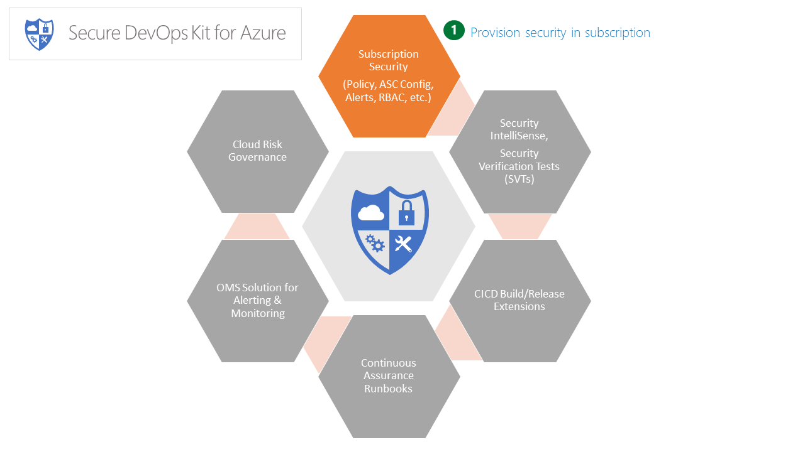

# AzSDK Subscription Security Package(SS)



### Contents:

### [AzSDK: Subscription Health Scan](Readme.md#azsdk-subscription-health-scan-1)
- [Overview](Readme.md#overview)
- [Subscription Health scan - In-depth](Readme.md#subscription-health-scan---in-depth)
- [Execute subscription health scan command](Readme.md#execute-subscription-health-scan-command)
- [Target specific controls of subscription health scan](Readme.md#target-specific-controls-of-subscription-health-scan)
- [FAQs](Readme.md#faqs)

### [AzSDK: Subscription Security Provisioning](Readme.md#azsdk-subscription-security-provisioning-1)
- [Overview](Readme.md#overview-1)
- [Execute subscription security provisioning command](Readme.md#execute-subscription-security-provisioning-command)
- [Remove AzSDK subscription security provisioning from your subscription](Readme.md#remove-azsdk-subscription-security-provisioning-from-your-subscription)
- [FAQs](Readme.md#faqs-1)

### [AzSDK: Subscription AccessControl (IAM)](Readme.md#azsdk-subscription-accesscontrol-iam-1)
- [Overview](Readme.md#overview-2)
- [Setup pre-approved mandatory accounts using AzSDK](Readme.md#setup-pre-approved-mandatory-accounts-using-azsdk)
- [Remove pre-approved mandatory accounts using AzSDK](Readme.md#remove-pre-approved-mandatory-accounts-using-azsdk)

### [AzSDK: Subscription Activity Alerts](Readme.md#azsdk-suscription-security-alerts)
- [Overview](Readme.md#overview-3)
- [Setup AzSDK alert configuration for your subscription](Readme.md#setup-azsdk-alert-configuration-for-your-subscription)
- [Remove AzSDK alert configuration for your subscription](Readme.md#remove-azsdk-alert-configuration-for-your-subscription)
- [Setup AzSDK alert for a specific resource group](Readme.md#setup-azsdk-alert-for-a-specific-resource-group)
- [FAQs](Readme.md#faqs-2)

### [AzSDK: Azure Security Center (ASC) configuration](Readme.md#azsdk-azure-security-center-asc-configuration-1)
	
- [Setup Azure Security Center (ASC) on your subscription as per AzSDK security standards](Readme.md#setup-azure-security-center-asc-on-your-subscription-as-per-azsdk-security-standards)

### [AzSDK: Suscription Security - ARM Policy](Readme.md#azsdk-suscription-security---arm-policy-1)

- [Overview](Readme.md#overview-4)
- [Setup AzSDK ARM policies on your subscription](Readme.md#setup-azsdk-arm-policies-on-your-subscription)
- [Remove AzSDK ARM policies from your subscription](Readme.md#remove-azsdk-arm-policies-from-your-subscription)
- [FAQs](Readme.md#faqs-3)

----------------------------------------------------------
## AzSDK: Subscription Health Scan

### Overview
 
The subscription health check script runs a set of automated steps to examine a subscription and flags off conditions that are indications that your subscription may be at a higher risk due to various security issues, misconfigurations or obsolete artifacts/settings. 

The following aspects of security are checked:
1. 	 Access control (IAM) configuration - IAM-related issues in the subscription
2. 	 Alert configuration - configuration of activity alerts for sensitive actions across various service types
3. 	 Azure Security Center configuration - configuration of ASC (security point of contact, various policy settings, etc.)
4. 	 ARM Policy and Resource Locks configuration - presence of desired set of ARM policy rules and resource locks. 

[Back to top…](Readme.md#contents)
### Subscription Health Scan - In-depth  
 
The subscription health check script runs a set of automated steps to examine a subscription and flags off conditions that are indications that your subscription may be at a higher risk due to various security issues, misconfigurations or obsolete artifacts/settings. 

The health check script reports progress to the console and summarizes findings at the end. Command outputs control evaluation summary to a CSV file and the details of each control evaluation to a LOG file (under "%LOCALAPPDATA%\Microsoft\AzSDKLogs\Sub_[yourSubscriptionName] ..." folder).

The various security checks performed by the health check script are listed in the table below. The subsequent section explains how to interpret output in the LOG file and how to resolve issues.

|Security rule checked   | Rationale|
|------------ | -------------|
|Minimize the number of admin/owners | Each additional person in the Owner/Contributor role increases the attack surface for the entire subscription. The number of members in these roles should be kept to as low as possible.|
|Mandatory central accounts must be present on the subscription|Certain central accounts are expected to be present in all subscriptions to support enterprise wide functions (e.g., for security scans, cost optimization, etc.). Certain other accounts may also be required depending on special functionality enabled in a subscription (e.g., for Express Route-network support/compliance checks). The script checks for presence of such 'mandatory' and 'scenario-specific' accounts.|
|Deprecated/stale accounts must not be present on the subscription|Further to the above RBAC check, some accounts were once deployed across subscriptions for some trial/pilot. These accounts should not be retained any more in any role. The script warns about presence of such 'deprecated' accounts as well.|
|Must not grant access to non-AD/AAD accounts (e.g., LiveId) in the subscription|All access to subscriptions, resource groups or individual resources at Microsoft must be gated via Microsoft corporate AAD (tenant) identities (replicated across from the corporate AD forest). The script checks that non-AD accounts (such as xyz@hotmail.com, pqr@outlook.com, etc.) are not granted permission at any level within a subscription.|
|Service accounts cannot support MFA and should not be used for subscription activity| Service accounts are typically not multi-factor authentication capable. Quite often, sloppy use of service accounts by teams who own them (e.g., to login interactively on servers) exposes their credentials to attacks such as pass-the-hash, phishing, etc. As a result, using service accounts in any privileged role in a subscription exposes the subscription to credential-theft related risks. (In effect, the subscription becomes accessible after the single-factor protection is compromised…defeating the pervasive multi-factor authentication (MFA) requirement we aim to enforce.)|
|There should not be more than 2 classic administrators|The v1 (ASM-based) version of Azure resource access model did not have much in terms of RBAC support. As a result, everyone who needed any access on a subscription or its resources had to be added to the Co-administrator role. These individuals are referred to as 'classic' administrators. In the v2 (ARM-based) model, this is not required at all and even the count of 2 classic admins currently permitted is for backward compatibility purposes. (Some Azure services are still migrating onto the ARM-based model so creating/operating on them needs 'classic' admin privilege.)|
|Use of management certificates is not permitted.|Just like classic admins above, management certificates were used in the v1 model for script/tool based automation on Azure subscriptions. These management certificates are highly risky because the hygiene around protection of the private key for these certificates tends to be lapse. These certificates have no place in the current ARM-based model and should be immediately cleaned up if found on a subscription. (VS-deployment certificates from v1 timeframe are a good example of this.)|
|Azure Security Center (ASC) must be correctly configured on the subscription.|The Security Center feature in Azure helps with important central settings for the subscription such as configuring a security point of contact. It also supports key policy settings (e.g., is patching configured for VMs?, is threat detection enabled for SQL?, etc.) and alerts about resources which are not compliant to those policy settings. Correctly configuring ASC is critical as it gives a baseline layer of protection for the subscription and commonly used resource types.|
|Pending Azure Security Center (ASC) alerts must be resolved.|Based on the policies that are enabled in the subscription, Azure Security Center raises alerts (which are typically indicative of resources that are not compliant with some baseline security protection). It is important that these alerts/actions are resolved promptly in order to eliminate the exposure to attacks.|
|Pending Azure Security Center (ASC) tasks and recommendations must be resolved.| Similar to the ASC alerts above|
|Service Principal Names (SPNs) should not be Owners/Contributors on the subscription|Just like AD-based service accounts, SPNs have a single credential and most scenarios that use them cannot support multi-factor authentication. As a result, adding SPNs to a subscription in 'Owners' or 'Contributors' roles is risky.|
|Critical application resources should be protected using a resource lock.|A resource lock protects a resource from getting accidentally deleted. With proper RBAC configuration, it is possible to setup critical resources in a subscription in such a way that people can perform most operations on them but cannot delete them. These protective mechanisms can help ensure that important data is not lost by accidental/malicious deletion of such resources (and ensure that availability is not impacted).
|ARM policies should be used to limit certain actions in the subscription that may impact security.| The AzSDK subscription security setup configures a set of ARM policies which result in audit log entries upon actions that violate the policies. (For instance, an entry is generated if someone creates a v1 resource in a subscription.) The health check script checks for the presence of these policies are present in a subscription.(Note that ARM policies are specific to ARM operations on resources and different than ASC policies mentioned in the ASC check above. ASC policies are more general things such as 'enable auto-patchin', etc.)|
|Alerts must be configured for critical actions on subscription and resources.| The AzSDK subscription security setup configures Insights-based alerts for sensitive operations in the subscription. These use the Azure Monitor feature to generate email notifications when sensitive actions happen in a subscription (e.g., if someone adds a new person to the Owners group or if a new certificate is uploaded to a web site). The health check script verifies if all such alerts as defined in the AzSDK alert configuration have been configured on a subscription.(Note that the AzSDK supports setting up alerts via OMS as well. This is an alternate mechanism that may be used. In the OMS-based approach, Azure activity logs are piped into an OMS workspace and alerts are configured on the OMS side based on various conditions.)|
|Do not use custom-defined RBAC roles.|Custom RBAC role definitions are usually tricky to get right. A lot of threat modeling goes in when the product team works on and defines the different out-of-box security roles. As much as possible, teams should use the out-of-box roles for their RBAC needs. Using custom roles is treated as an exception and requires a rigorous review.| 
|Do no use any classics resources on a subscription.|You should try to use new AzureRM resources as it would provide better access control and auditing features| 
 
[Back to top…](Readme.md#contents)
### Execute subscription health scan command 

The subscription health check script can be run using the following command by replacing with your subscriptionId
```PowerShell
Get-AzSDKSubscriptionSecurityStatus -SubscriptionId <SubscriptionId>
```
The parameters used are:
- SubscriptionId – Subscription ID is the identifier of your Azure subscription 

You need to have at least **Reader** role at the subscription scope to run this command. 

> **Note**: The step that checks for presence of Management Certificates will fail while running as a "Reader". Unfortunately, the only way to check for those is if you are running as a Co-Administrator - which is itself a bad practice. This is a limitation of the ASM/ARM API and has been reported to the PG.

[Back to top…](Readme.md#contents)
### Target specific controls of subscription health scan

The subscription health check script support multiple parameters as specified below
The parameters used are:
- SubscriptionId – Subscription ID is the identifier of your Azure subscription 
- FilterTags  - Comma seperated tags to filter the security controls. e.g.: RBAC, SOX, AuthN etc.
- ExcludeTags - Comma seperated tags to exclude the security controls. e.g.: RBAC, SOX, AuthN etc.
- ControlIds  - Comma seperated AzSDK control id's to filter the security controls. e.g. Azure_Subscription_AuthZ_Limit_Admin_Owner_Count.
```PowerShell
Get-AzSDKSubscriptionSecurityStatus -SubscriptionId <SubscriptionId> [-ControlIds <ControlIds>] [-FilterTags <FilterTags>] [-ExcludeTags <ExcludeTags>]
```
These different parameters would enable you to execute subscription health scan in different flavours, scan only SOX relevant controls or AuthZ related controls or exclude best practices or even execute a specifc control. Below are some examples:

1. Execute only SOX related controls
```PowerShell
Get-AzSDKSubscriptionSecurityStatus -SubscriptionId <SubscriptionId> -FilterTags "SOX"
``` 
2. Exclude *Best-Practice* while doing *AuthZ* related subscription health scan
```PowerShell
Get-AzSDKSubscriptionSecurityStatus -SubscriptionId <SubscriptionId> -FilterTags "AuthZ" -ExcludeTags "Best Practice"
``` 

3. Execute ASC related security control of subscription health scan 
```PowerShell
Get-AzSDKSubscriptionSecurityStatus -SubscriptionId <SubscriptionId> -ControlIds Azure_Subscription_Config_Azure_Security_Center
``` 

[Back to top…](Readme.md#contents)
### FAQs

#### How to clean up excessive number of admins?

You can clean up unwanted admins/owners through portal by following below instructions:
1. Cleaning up classic administrators 
    * Logon to [https://manage.windowsazure.com/](https://manage.windowsazure.com/)
	* Navigate to the Settings tab followed by click ad ministrators tab to list all the administrators as shown below  
      
    * Select the account that has be removed and click on the Remove icon on the bottom ribbon as show in the below figure  
      
    * Perform this operation for all the accounts that has to be removed from the subscription.

2. Cleaning up subscription owners  
    * Logon to [https://portal.azure.com/](https://portal.azure.com/)
    * Navigate to the below path for your subscription  
      
    * Select the account that has to be removed and in the extended menu of each account row, you should see remove user button. This should remove the account from the subscription
    * Perform the same operation on the account that has to be removed the subscription.
    
#### How to clean up Management Certificates on a subscription?
You can clean up management certificates through portal by follwing below instructions:
* Logon to [https://manage.windowsazure.com/](https://manage.windowsazure.com/)
* Navigate to the Settings tab followed by click Management certificates tab to list all the certificates as shown below  
     
* Select the certificate that has be removed and click on the Delete button on the bottom ribbon as shown in the below   
     
* Perform this operation for every management certificate on subscription.  

[Back to top…](Readme.md#contents)

-----------------------------------------------------------------------  
## AzSDK: Subscription Security Provisioning

### Overview
The Subscription Security (SS) Provisioning script is a master script that, in turn, invokes multiple other scripts to setup up all of the following in the target subscription:
- A set of mandatory accounts that are required for central scanning/audit/compliance functions.
- A group of Azure activity alerts for activities deemed to be critical and high severity.
- A baseline set of ARM Policies corresponding to certain actions that are considered insecure.
- Default enterprise policy settings for Azure Security Center (ASC).
- Security contact information (in Azure Security Center).

[Back to top…](Readme.md#contents)
### Execute subscription security provisioning command
The Subscription Security setup script can be run by providing the subscriptionID and security contact E-mails (comma separated values)
```PowerShell
Set-AzSDKSubscriptionSecurity -SubscriptionId <subscriptionId> -SecurityContactEmails <SecurityContactEmails>
```
When the script starts, it removes existing/previously configured AzSDK artifacts in the subscription such as alerts, RBAC, ARM policies, etc. Anything that is considered 'mandatory' is not removed.  

[Back to top…](Readme.md#contents)
### Remove AzSDK subscription security provisioning from your subscription
The subscription setup created by the above command can be removed by running:
```PowerShell
Remove-AzSDKSubscriptionSecurity -SubscriptionId <subscriptionId> -Tags <TagNames>
```
This command cleans up all the configured AzSDK alerts. It also removes AzSDK IAM accounts and AzSDK ARM policies based on the specified tags. This command doesnt touch the Azure Security Center related settings.

[Back to top…](Readme.md#contents)
### FAQs

#### Is it possible to setup an individual feature (e.g., just alerts or just ARM Policy)?
Yes, each of the components of the overall subscription provisioning setup can be individually run/controlled. 
You can run cmdlets in isolation for the following:
1. RBAC roles/permissions
2. Alerts
3. ARM Policy
4. Azure Security Center Configuration

[Back to top…](Readme.md#contents)
	
------------------------------------------------------------
## AzSDK: Subscription AccessControl (IAM)

### Overview
The subscription IAM provisioning script will setup certain permissions in the subscription that enable central security and compliance teams to perform automated scans and manual review/assessment activities in the subscription. This basically involves addition of some common accounts (service principal or security groups) to one or more roles in the subscription. The script also supporting provisioning of some optional accounts based on the scenarios that the subscription is used for.  

[Back to top…](Readme.md#contents)
### Setup pre-approved mandatory accounts using AzSDK
The subscription IAM provisioning script can be run using the following command (by specifying the subscriptionId for the subscription in which you want to provision the various roles):
```PowerShell
Set-AzSDKSubscriptionRBAC -SubscriptionId <subscriptionId> 
```
The subscription IAM provisioning script ensures that certain central accounts and roles are setup in your subscription.

[Back to top…](Readme.md#contents)
### Remove pre-approved mandatory accounts using AzSDK

Accounts which are tagged as 'mandatory' cannot be removed via AzSDK. Only the other accounts can be removed by specifying a tag to indicate which ones.

Run the below command with the subscriptionId which you want to remove RBAC accounts from:
```PowerShell
Remove-AzSDKSubscriptionRBAC -SubscriptionId <subscriptionId> -Tags <TagName>
```		
[Back to top…](Readme.md#contents)

----------------------------------------------------------
## AzSDK: Suscription Security Alerts

#### Subscription Activity Alerts (based on Azure Insights)

> **Note**: The alerts setup covered on this page uses the native 'Insights-based' alerts mechanism offered by the Azure PG. In the 'Alerting & Monitoring' section, we also cover support for OMS-based alerts which enable similar scenarios (and more). We have found that both approaches are in use across LoB application teams.
### Overview
This module helps setup and manage subscription and resource activity-based alerts in your Azure subscription. These alerts can be configured against actions that get recorded in Azure Audit Logs. These activity logs are natively generated upon resource activity by various ARM-based log providers (which are typically correspond to the different resource types in Azure). 

It is important to understand the concept of 'control plane' and 'data plane' in order to follow exactly which type of activities get covered by these alerts. In the ARM-model for Azure, everything that you can create from a subscription (at the portal or from PS) is considered a 'resource'. Various activities performed on these resources that you can do using the ARM APIs generate activity logs. For e.g., you can change the replication type of a storage account or you can set the size of an availability set, etc. These activities are usually considered 'control plane' activities. However, there are a set of activities that can happen "inside" the resource. For e.g., if you have a VM, you could log in to it as an Admin and add someone as a Guest user. Or just create a new folder under "C:\windows". These actions are usually considered 'data plane'. Insights-based alerts don't directly support alerting on 'data plane' actions. As is evident, each type of resource (VM, SQL Server, ADLS, etc.) will have their own ways of generating 'data plane' activity so alerting from that layer is usually very specific to each resource type. (Events from the 'data plane' are sometimes called 'Diagnostic Logs' whereas events from the 'control plane' are called 'Activity Logs'.)

In the context of this script, we have triaged the 200 or so activities that generate activity log entries and distilled them down to a subset that can be of interest to security. That subset was further triaged into Critical, High, Medium and Low severity alerts.

The basic script flow configures these alerts after taking an email id as input. After the alerts are setup, whenever a particular activity happens (e.g., adding a new person in the "Owners" group or modifying user defined routes on a virtual network), the configured email ID receives an email notification.  
 
[Back to top…](Readme.md#contents)
### Setup AzSDK alert configuration for your subscription
You can setup alerts for a subscription using the following command:
```PowerShell
Set-AzSDKAlerts -SubscriptionId <subscriptionid> -SecurityContactEmails <SecurityContactEmails>
```
	
As noted above, by default alerts are configured for activities that are deemed to be Critical or High in severity by AzSDK.

|Config Param Name	|Purpose	|Comments|
| ----------------  | --------- | ------ |
|SubscriptionId 	|Subscription ID against which the alerts would be setup| |
|SecurityContactEmails	|Email address of Security Point of Contact, can be a mail enabled security group or a distribution list |pattif@contoso.com, davidchew@contoso.net|

[Back to top…](Readme.md#contents)
### Remove AzSDK alert configuration for your subscription
- Steps to remove all the alerts configured by AzSDK:  
Run the below command:
```PowerShell
Remove-AzSDKAlerts -SubscriptionId <SubscriptionID> -Tags <TagNames>
```
	
|Config Param Name	|Purpose	|
| ----------------  | --------- | 
|SubscriptionID	|Subscription ID against which these alerts would be setup|
|Tags |Comma-separated alert tag names which needs to be removed|

**Note**: This command cleans up all alerts in the resource group [TBD]. This resource group is used internally by AzSDK as a container for the alert objects it registers. As a result, it is advisable to not add other alerts (or other types of resources) to this RG.
   
- Steps to clean all the alerts:  
    You could simply delete the resource group under which all the Azsdk alerts are configured by running below command.
```PowerShell
Remove-AzSDKAlerts -SubscriptionId <SubscriptionId> -DeleteResourceGroup 
```
[Back to top…](Readme.md#contents)
### Setup AzSDK alert for a specific resource group
You may be interested in enabling alerts but only for resources within a particular (target) resource group. This may be done using the -TargetResourceGroup parameter. 

Run the below command
```PowerShell
Set-AzSDKAlerts -SubscriptionId <subscriptionid> -TargetResourceGroup <TargetRGName>
```
These parameters above has to be updated with the appropriate values. See the table below for details.

|Config Param Name	|Purpose	|
| -----------------  | --------- | 
|SubscriptionId 	|Subscription ID against which these alerts would be setup	| 
|TargetResourceGroup 	|Target resource group on which alerts needs to be configured	|

[Back to top…](Readme.md#contents)
### FAQs
#### Can I get the alert emails to go to a distribution group instead of an individual email id?
Yes it is possible. While setting up the alerts you are asked to provide the SecurityContactEmails. It supports individual point of contact or mail enabled security group or a distribution list.  

#### How can I find out more once I receive an alert email?
You should visit portal with the details data provided in the Alert Email. For example, you could visit the resource id and look for the action that has been called out in the email, or to get more details about the alert, visit the Activity Log in the portal and look for this resource type, you should find more details on the action performed.  

**Note:** 
These alerts template and the generation is completely controlled through Azure Application Insights framework. 

#### Is there a record maintained of the alerts that have fired?
You could run the below command to check the alerts raised on the subscription.
```PowerShell
Get-AzureRmLog | where {$_.OperationName -eq "Microsoft.Insights/AlertRules/Activated/Action"}
```  
#### Troubleshooting
|Error Description	|Comments|
| --------------  | ------- |
|Error: Please enter valid subscription id!|	Provided subscription id is incorrect|
|Error Occurred! Try running the command with -Debug option for more details. |Failed to setup the policy. Share the details of the errors to [TBD]|

[Back to top…](Readme.md#contents)

----------------------------------------------------------
## AzSDK: Azure Security Center (ASC) configuration

### Setup Azure Security Center (ASC) on your subscription as per AzSDK security standards

The Set-AzSDKAzureSecurityCenterPolicies provisions the following for Azure Security Center (ASC) configuration:
1. Configure Azure Security Center by enabling all policies and rules.
2. Configure email address and phone number for contact preferences.

**Prerequisites:**
1. You need to be owner on the subscription which you want to onboard on to ASC.
2. Ensure you have the latest AzSDK modules installed.

**Steps to onboard onto ASC:**
1. Open PowerShell under non admin mode.
2. Login into your Azure Account using Login-AzureRmAccount.
3. Run the below command with the subscriptionId on which you want to configure Azure Security Center.
```PowerShell
Set-AzSDKAzureSecurityCenterPolicies -SubscriptionId <subscriptionId>  
```
>**Note:** The Get-AzSDKSubscriptionSecurityStatus (see the SS-Health Check page) master script can be used to check Azure Security Center settings (amongst other things). That script checks for the following w.r.t. Azure Security Center: 
>1.  All ASC policies are configured per expectation.
>2. There are no pending ASC tasks.
>3. There are no pending ASC recommendations.  
(Presence of either of Tasks/Recommendations indicates that there are some security issues that need attention.)  

[Back to top…](Readme.md#contents)  

----------------------------------------------------------
## AzSDK: Suscription Security - ARM Policy

### Overview
The native ARM Policy feature in Azure can be used control access to resources by explicitly auditing or denying access to certain operations on them. The ARM Policy setup script in the AzSDK uses this feature to define and deploy some broadly applicable security policies in the subscription. By using the setup script (either standalone or through the overall SS-Provisioning script), you can be assured that the subscription is compliant with respect to the core set of policies expected to be in place by AzSDK.

[Back to top…](Readme.md#contents)
### Setup AzSDK ARM policies on your subscription
You can install the ARM policies via the Set-AzSDKARMPolicies cmdlet as below:
1. Login to your Azure Subscription using below command
	
```PowerShell
Login-AzureRmAccount
```
	
2. Once you have installed the AzSDK, you should be able to run the below command
	
```PowerShell
Set-AzSDKARMPolicies -SubscriptionId <subscriptionid>
```
	
|Config Param Name	|Purpose	|
| --------------- | -------- |
|SubscriptionId 	|Subscription ID against which these alerts would be setup	|

[Back to top…](Readme.md#contents)
### Remove AzSDK ARM policies from your subscription
Use the following command to remove the ARM policies setup via the AzSDK 

```PowerShell
Remove-AzSDKARMPolicies -subscriptionId <subscriptionId> -Tags <TagNames>
```
You can also use native Azure PS commands to do the same. Refer to this MSDN [article](https://msdn.microsoft.com/en-us/library/mt652489.aspx) for more details.

[Back to top…](Readme.md#contents)
### FAQs
#### What happens if an action in the subscription violates the policy?
Currently "effect" parameter of all the AzSDK policies is configured as "audit". So, in the event of policy violation, it would generate an audit log entry. You should watch for these policy violation audit events in the Azure audit log.

#### Which ARM policies are installed by the setup script?
The ARM policy configuration script currently enables the following policies in the subscription. Note that the policy level is currently set to 'Audit'.

|PolicyName	|Description|
| ---------- | --------- |
|AzSDK_ARMPol_Audit_NonGRS_Storage_SKU	|Policy to audit storage account with Standard LRS replication|
|AzSDK_ARMPol_Audit_Job_Scheduler_Free_Tier |Policy to audit job scheduler with free tier|
|AzSDK_ARMPol_Audit_Old_SQL_Version	|Policy to audit SQL server version less than 12.0|
|AzSDK_ARMPol_Audit_NonHBI_Resource_Create	|Policy to audit any actions on resources other than compute, storage and network type|
|AzSDK_ARMPol_Audit_Classic_Resource_Create	|Policy to audit creation of classic resources|
|AzSDK_ARMPol_Audit_SQL_Basic_Create |Policy to audit database with 'Basic' edition type" |

>Policy definitions exist in the JSON file at this location: 
 C:\Users\SampleUser\Documents\WindowsPowerShell\Modules\AzSDK\2.0.xxxxxx.yy\Framework\Configurations\SubscriptionSecurity\Subscription.ARMPolicies.json

#### How can I check for policy violations? 
You could run the below command to check for the policy violations on the subscription. By default this shows the violations for the last one hour. Other intervals can be specified.
```PowerShell
Get-AzureRmLog | where {$_.OperationName -eq "Microsoft.Authorization/policies/audit/action"} 
```

Refer to this [MSDN article](https://azure.microsoft.com/en-in/documentation/articles/resource-manager-policy/#policy-audit-events) for more details

#### Are there more policies available for use?
We have covered for the below resource types so far:
- Azure SQL DB
- Azure Storage
- Scheduler Service
- Usage of classic (v1/non-ARM) resources
 More policies will be added in upcoming releases.
	
#### Troubleshooting

|Error Description	|Comments|
| ----------------- |--------|
|Error: Please enter valid subscription id! |Provided subscription id is incorrect|
|Error Occurred! Try running the command with -Debug option for more details.	|Failed to setup the policy. Share the details of the errors to [TBD] |

Reach out to [TBD] for any further help  

[Back to top…](Readme.md#contents)

