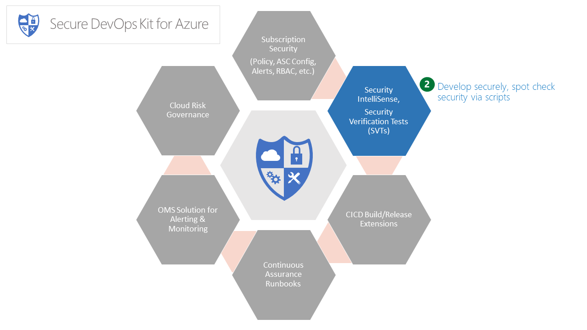

# Secure Development

The Secure Development components of the AzSDK enable a developer to build a cloud application with 
security baked in during coding, prototyping and PoC deployment stages. 

These features of the AzSDK are 'interactive'...in the sense that a developer leverages them in an ad hoc
(or as needed) manner.

The following features are included in this area:
1. [Security Verification Tests (SVTs)](Secure_Development_userguide.md) -  SVTs automate the verification
of security controls for a large number of commonly used Azure Services (E.g., App Service, Storage, 
Azure SQL DB, Key Vault, Virtual Machine, etc.)
2. [Security IntelliSense (SecIntel)](Security_IntelliSense_userguide.md) - Augments traditional VS IntelliSense 
with secure coding knowhow and offers corrections, tips and guidelines *while* a developer writes code. 
The secure coding rules covered include various Azure PaaS APIs, Azure Authentication based practices to 
traditional web application security and crypto issues.
	
