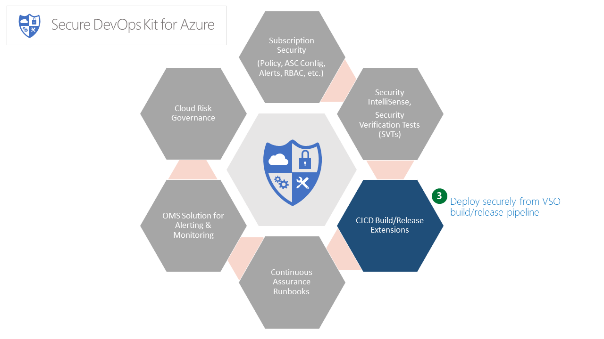
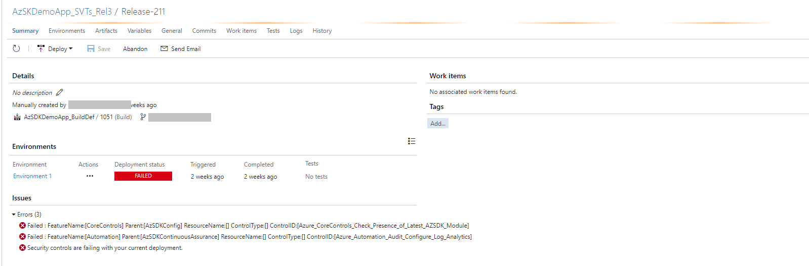

# Security Verification Tests (SVTs) in CICD Pipeline

> **Notes** 
> - We also plan to support miniaturized ARM templates which can be combined with existing templates and, subsequently, to analyze 'ARM template equivalence' from a security standpoint.
> - We have built a PoC for a similar CICD extension for Jenkins for AzSDK. Documentation for the Jenkins extension will be added soon.
 <!-- #TODO# Jenkins doc --> 
 
## Contents
- [Overview](Readme.md#overview) 
- [Enable AzSDK extension for your VSTS](Readme.md#enable-azsdk-extension-for-your-vsts) 
- [Walkthrough](Readme.md#walkthrough)
  - [Adding SVTs in the release pipeline](Readme.md#adding-svts-in-the-release-pipeline)
  - [Verifying that SVTs have been added and configured correctly](Readme.md#verifying-that-the-svts-have-been-added-and-configured-correctly)
- [Remediating Failures and Next Steps](Readme.md#remediating-failures-and-next-steps)
------------------------------------------------------------------
### Overview 
The AzSDK contains Security Verification Tests (SVTs) for multiple PaaS and IaaS services of the Azure platform. 
As we have seen so far, these SVTs can be manually run against one or more target resources held in 
resource groups or tagged via a {tagName, tagValue} pair.

While it is invaluable to run these SVTs periodically from a PS console (to ensure that the subscription and 
the different resources that comprise your application are in a secure state), a key aspect of dev ops is 
to be able to automate such tests and integrate them as part of the dev ops workflows and release pipelines.
In other words, while checking that SVTs pass in an ad hoc manner is a good practice, it is important
to be able to also ensure that security control configuration remains intact in higher environments.

The CICD extensions feature of AzSDK makes automated security configuration enforcement possible by 
making SVTs available as a Visual Studio Extension in the Marketplace so that engineering teams can run 
them within build/release pipeline. Once the build/release 
task is configured, SVTs run against a target deployment in an Azure subscription. Upon completion, 
SVTs will report the pass/fail status for controls along with aggregate control results. Hereafter, all the different 
'out-of-box' build/release workflow options from the CICD engine (e.g., VSTS)  can be used as 'next steps' based on 
the outcomes of SVTs. (For instance, one can decide whether to fail the release outright or to continue 
despite failures while sending an email to the build/release owners or to hold progress until someone 
manually approves, etc. Furthermore, if all SVTs pass in the pre-prod environment, then a release can 
be 'promoted' to prod.) 

Outcomes of the SVT execution can also be routed to an OMS workspace configured to receive various events 
generated by the AzSDK.

[Back to top...](Readme.md#contents)

### Enable AzSDK extension for your VSTS

This extesion has been published to the VSTS gallery as a 'private' extension. 
If you are interesed in enabling this extension on your VSTS instance, please drop a mail 
to <a href="mailto:azsdksupext@microsoft.com?subject=Request:-Enable-AsSDK-extension-for-VSTS">AzSDK Support</a> 
and include the URL to your VSTS instance so we can share the extension for your tenant. 
Once we share the extension, your VSTS admin will need to approve/enbale it for you.

### Walkthrough
This part assumes that you are familiar with VS build tasks and pipelines at a basic level. To demonstrate 
the capability of the feature, we will use a basic MVC Web App that is checked into our trial repository. 
Our goal is to show how SVTs can be injected into the build/release workflow so that security testing for 
Azure subscription and resources is seamlessly integrated into CICD.  

[Back to top...](Readme.md#contents)
### Adding SVTs in the release pipeline

**Step-1:** Create a release definition or open an existing one.  
<!-- #TODO# make this end-to-end with AzSDKDemoApp in GitHub etc -->
(Note: Here we will edit "AzSDKDemoApp_SVTs_Rel3" which is part of our test instance of VSTS.
We also have a default build definition upstream to this which is not shown here as that is a pretty 
standard web app build flow using an MSBuild task.)  

As shown below, currently the release definition is configured to simply deploy a web app upon building 
it to a particular app service at the given URL. This is likely to be the state of any working CICD
pipeline that builds and deploys a web app (or App Service) from VSTS to an Azure subscription. 

Let us take a look at the steps needed to add the AzSDK-SVT task to the release definition.

**Step-2:** Add the AzSDK-SVT release task to the pipeline.  
Click on "Add Tasks", and select "AzSDK Security Verification Test".  

  
Click on "Add" and "Close". 

> **Note:** The VSTS dialog doesn't provide a good visual indication but the task does 
get added when you click "Add" once!

**Step-3:** Specify the input parameters for the SVT task.  
The "AzSDK_SVTs" task starts showing in the "Run on Agent" list and displays some configuration inputs 
that are required for the task to run. These are none other than the familiar options we have been specifying 
while running the AzSDK SVTs manually - you can choose to specify the target resource group(s) or 
a {tagname, tagvalue} pair based on how your application's resources are organized.  
When the pipeline executes, SVTs will scan the specified set of resources.

Along with input parameter, you can check for below options
 **Enable OMS Logging:** Switch to enable this task to publish SVT evalution results to an OMS workspace. Steps to configure OMS credential are explained in Step-4
 **Aggregate Control Status:** Switch to aggregate the SVTs control output. When this is turned off it would show all the failed individual controls in the task summary output.
 **Use Preview Modules of AzSDK:** Switch to toggle use of preview drop of AzSDK SVTs. By default it is configured to use latest bits of AzSDK.

**Step-4:** (Optional) Setup connectivity from CICD to OMS.  
> **Note:** You can skip this step in a first pass exploration of CICD integration of SVTs. 

This feature enables you to route the control scan results from SVTs in CICD pipelines to an OMS workspace.
Configuring an OMS workspace for the AzSDK_SVTs task basically enables monitoring capability for 
build environments. Each time SVTs run in CICD, the AzSDK events generated will be sent to 
the OMS repository and become available for subsequent queries, actions, alerts, etc. in the OMS workspace.
(The AzSDK includes an OMS solution that can be used to create a 'single dashboard' view of security 
for one or more applications across multiple dev ops stages.)  
  
Below, we have added config info of a trial OMS workspace used by the AzSDK team. You should choose your 
own target OMS workspace and the corresponding resource group instead. (You can use Get-AzureRmOperationalInsightsWorkspace 
cmdlet to quickly find out the resource group corresponding to your OMS workspace. If you do not know your
app's OMS workspace, you should check with your monitoring lead. Else you can create a trial workspace with
the 'Free' tier option.)   
  
The OMS workspace information may be provided using one of the two options below:  
**Option-1:** Use a 'variable group'  
In this option, a single variable group may be defined at the VSTS level to represent the OMS workspace 
that a collection of projects want to share. This variable group may be 'linked' from the individual 
build/release definitions across these projects. The benefit is that, in the future, if a key value changes, 
you just have to make that change in one place and all definitions will immediately reflect the change.

The images below show this option. It involves 2 steps:  
1. 	 Create a variable group that holds the OMS info (if one doesn't exist for your org) 
2. 	 Link that variable group to your project's release definition

The variable group name can be a unique name you can choose (and specify in the release task definition). 
The specific variable names for workspace ID and shared key have to be exactly as shown below. The values 
of these should correspond the corresponding info for your OMS workspace.  
  
Creating the variable group:

Linking to the release definition:

> **Note:** Variable groups can only be modified or added from the Library under VSTS instance.

**Option-2:** Directly use variables in individual build definitions.
 

Important: Ensure that the variable names used are exactly as above and the values correspond 
to *your* OMS workspace. Moreover, when you specify the OMS shared key, click on the 'lock' icon 
next to it so that it gets masked.

**Step-5:** (Optional) Setup Online Policies URL  
(You may skip this step in a first-pass exploration of CICD integration of SVTs.) 
This feature enables you to set up online policies. 
This enables the CICD extension to use org-specific policies. 
<!-- #TODO# Clarify. Need IT-specific instructions too! Or it should just work for IT. --> 

Below, we have added configuration info of 'AzSDKServerURL' used by the AzSDK team.  

The online Policy URL information may be provided using one of the two options below:  

**Option-1**: Use a 'variable group'  
In this option, a single variable group may be defined at a VSTS level to represent the Policy URL that 
a collection of projects want to share. This variable group may be 'linked' from the individual 
build/release definitions across these projects. The benefit is that, in future, if a value changes, 
you just have to make that change in one place and all definitions will immediately reflect the change.  

The images below show this option. It involves 2 steps:  
1. Create a variable group that holds the URL info (if one doesn't exist for your org) 
2. Link that variable group to your project's release definition

The variable group name can be a unique name you can choose (and specify in the release task definition). 
The specific variable name for Policy URL  has to be exactly as shown below. 
  
Creating the variable group:  
    

Linking to the release definition:    
 
> Note: Variable groups can only be modified or added from the Library under VSO instance.

**Option-2**: Directly use variables in individual build definitions.  
    

**Step-6**: Save the Release Definition.
  
  

[Back to top...](Readme.md#contents)
### Verifying that the SVTs have been added and configured correctly
**Step-1:** Start the release pipeline. 
This can be done by adding a new release for an existing build (or trigger a new release via a minor/trial 
check-in). 

**Step-2:** Verify that the release pipeline has started. 
Once the release is triggered, we can see that it is in progress by clicking on "Releases" (or via 
"Build & Release" menu in the VSTS menu).

**Step-3:** View the release outcome.  
In a few minutes the release pipeline should complete and we can view the outcomes as shown below (in the 
pic below we can see that the release pipeline has failed):

**Step-4:** Look at the "Issues" to see why the release failed.  
The summary output shows the cause of failure (in this case it is because the AzSDK SVTs have failed).

**Step-5:** Look at the complete output log of the AzSDK portion of the release pipeline execution . 
Clicking on the "Security controls are failing" text (in the pic above) and, further, clicking on 
the "AzSDK_SVTs" link (in the pic below) will show the details about the SVT execution and failures. 
Notice how the output is the same as what is displayed when SVTs are manually run in a PS console!
Essentially, the AzSDK_SVTs extension gives us the capability to mirror the secure configuration state
that was established during the development/prototyping phases.

**Step-6:** See the summary "CSV" and detailed "LOG" output files for the AzSDK SVTs.  
This is no different than the "ad hoc SVT run" scenarios. Note, above, how the SVT outputs the location 
of the "CSV" file and the "LOG" file at the end of the run. However, those locations are on the release 
agent machine. These are also packaged up in an overall ZIP file and are available to download. The 
overall ZIP file can be downloaded by clicking on the "Download all logs as ZIP" option.  
The ZIP file "ReleaseLogs_dd.zip" contains LOGs from the entire release pipeline including the master 
output for the AzSDK_SVTs. The CSV file and the LOG file for AzSDK SVTs are embedded in the 'inner' ZIP 
file that is named according to the parameterSet chosen to run the SVTs (in the pic below the ZIP file 
is named by the target resource group that we used 'mptestrg').

 

Opening/extracting the "AzSDK_Logs" ZIP file will reveal a folder structure and files placement identical to 
what we have seen in the case of ad hoc SVT runs:

[Back to top...](Readme.md#contents)
### Remediating failures and next steps
Once you have the CSV file and the LOG file for the SVTs execution, the process of understanding and 
remediating failures is no different than what is used when SVTs are run manually. Basically, you will 
need to look at the failed SVTs in the CSV file and the corresponding details about 'what exactly caused 
each individual failure?' in the LOG file. Thereafter the issue can be remediated (additional guidance 
available from AzSDK is at the link in the CSV file for each row).  

If you chose to route events to OMS, you can also use the AzSDK Solution Pack for OMS to view things 
like "build/release security health", long term trends, configure and receive alerts for various 
conditions (e.g., back to back SVT failures) etc.

[Back to top...](Readme.md#contents)
