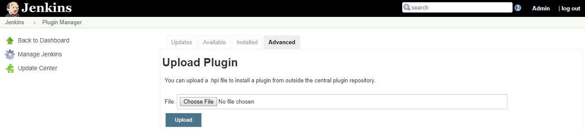
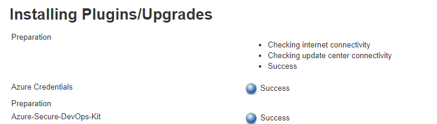
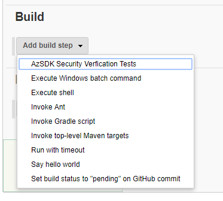
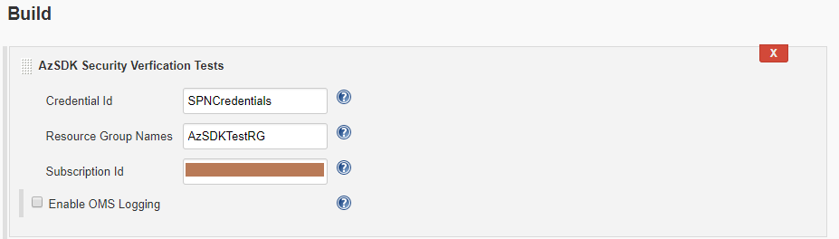
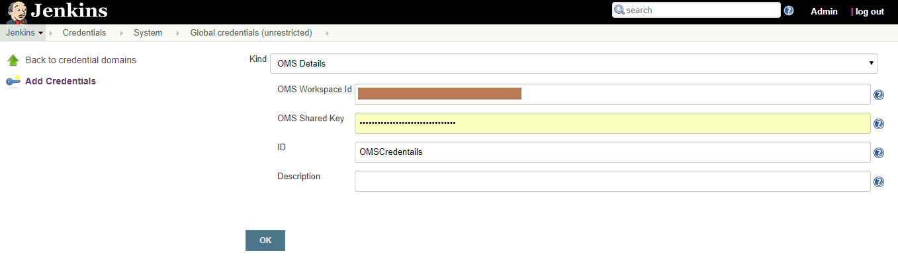
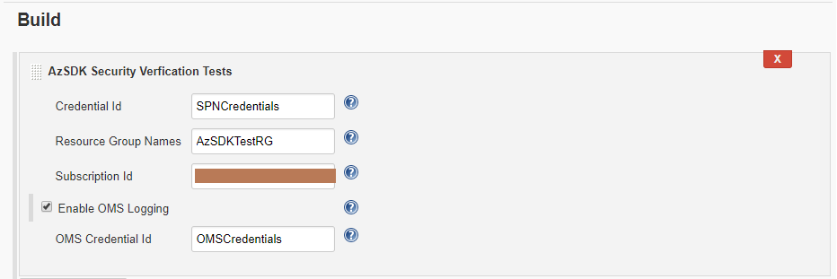
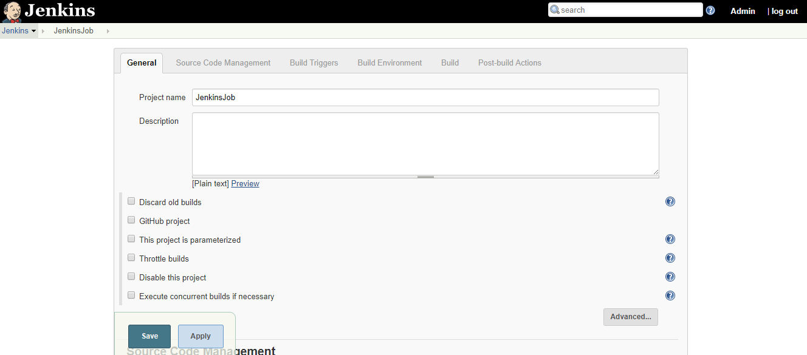
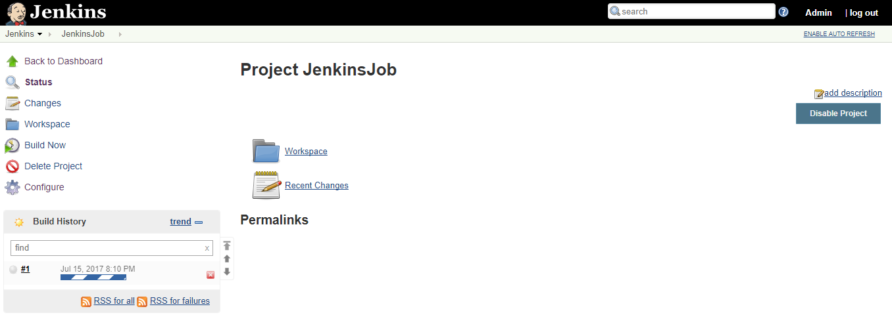
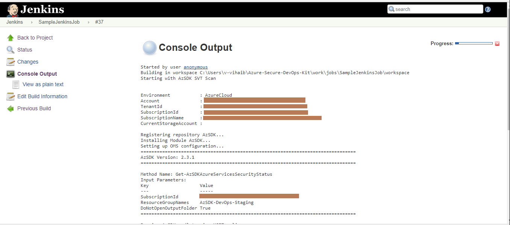
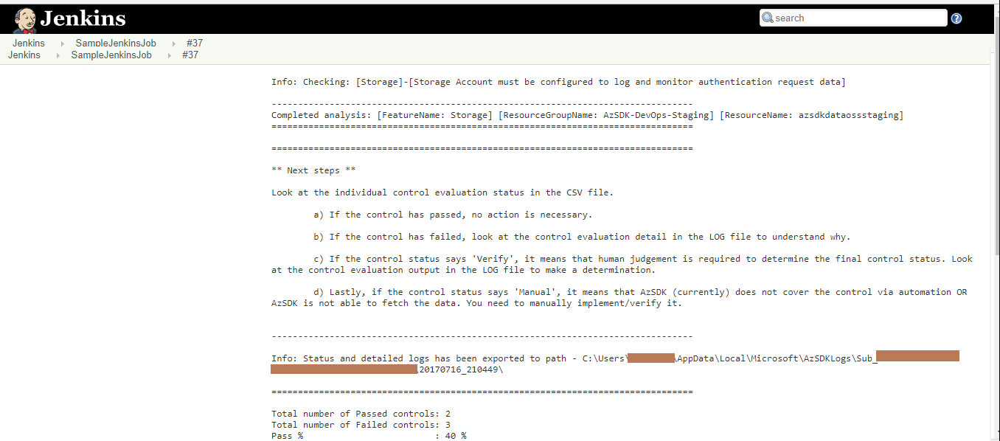

# Security Verification Tests (SVTs) in Jenkins Pipeline
> Prerequisites :  
> This document assumes that you are familiar with Jenkins pipelines at a basic level. To get the basics and setup Jenkins you can refer [article](https://jenkins.io/doc/).
	
Walkthrough is divided into two parts
1. [Import AzSDK Plugin in Jenkins](Security_In_CICD_Jenkins_userguide.md#import-azsdk-plugin-in-jenkins)
2. [Run SVT on resources in Jenkins pipeline](Security_In_CICD_Jenkins_userguide.md#run-svt-on-resources-in-jenkins-pipeline)
	
> Note : AzSDK Plugin requires PowerShell to be present on Jenkins Server so currently plugin is supported for Windows machines only.
> 	

### Import AzSDK Plugin in Jenkins
	
Currently AzSDK Jenkins Plugin is not hosted on Jenkins community repositories. You can use Jenkins web UI to upload this plugin(Azure-Secure-DevOps-Kit.hpi file) to Jenkins or place it in '$JENKINS_HOME/plugins' location.
	
[ToDO:Attachment]
	
**Step to upload plugin using Jenkins Web UI**
	
 **Go to:** Home Page --> Manage Jenkins --> Manage Plugins -->  Select Advanced --> Upload Plugin file "Azure-Secure-DevOps-Kit.hpi"

  

After successful installation you can start using plugin.  
 

### Run SVT on resources in Jenkins pipeline
	
- #### Step-1: Configure Service Principal (SPN) credentials
    a. Go to Home Page -->  Credentials --> System --> Global Credentials  --> Click on "Add Credentials" --> Select credential type "Microsoft Azure Service Principal"
    b. Fill out the details Subscription Id, Client ID, Client	Secret, OAuth 2.0 Token Endpoint and ID.
    c. Click on "Verify Service Principal" to validate SPN details are correct 
    d. Click Ok.
	
	
- #### Step-2: Create a Jenkins Job or open an existing one.
		
	Refer [article](https://www.tutorialspoint.com/jenkins/jenkins_setup_build_jobs.htm) to create sample build job
	
- #### Step-3: Add the AzSDK-SVT build step to the pipeline.
	
	 Click on  "Add build step" and select "AzSDK Security Verification Tests".

 
  

- #### Step-4: Specify the input parameters for the SVT step.
	Step displays some configuration inputs that are required for the task to run. Specify SPN credentials id configured in Step-1. Remaining inputs are none other than the familiar options we have been specifying while running the AzSDK SVTs manually. When the pipeline executes, SVTs will scan the specified set of resources.  
 
	
- #### Step-5: (Optional) Setup connectivity from CICD to OMS.
	The OMS workspace information can be provided using below steps:
	- Create OMS workspace credentials  
		**Go to:** Home Page -->  Credentials --> System --> Global credentials  --> Click on "Add Credentials" --> Select credential type "OMS Details"  
		Provide OMS details and click Ok
		
   
    

	- Provide OMS Credentials Id in build step  

  	
- #### Step-6: Save the Job 

- #### Step-7: Trigger build and you will be able to see the SVT scan result in Console Output
	
	
 
 
 
  
	  
	
> 	Note :
> 	- Currently build does not stop on failure of SVTs 
> 	- All SVT reports are exported to Jenkins Server Machine.
