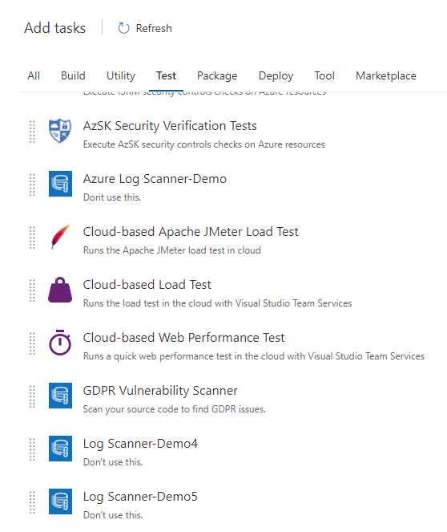
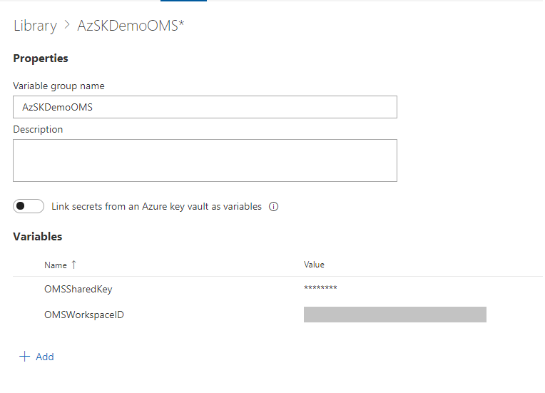
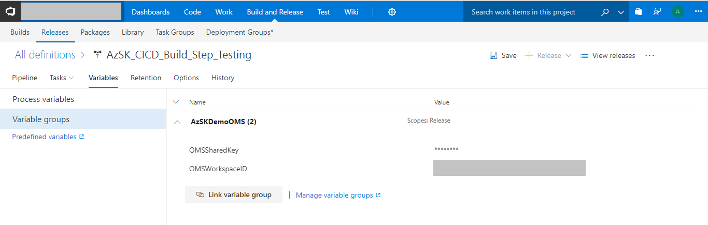
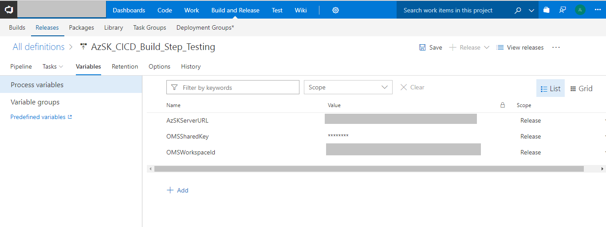
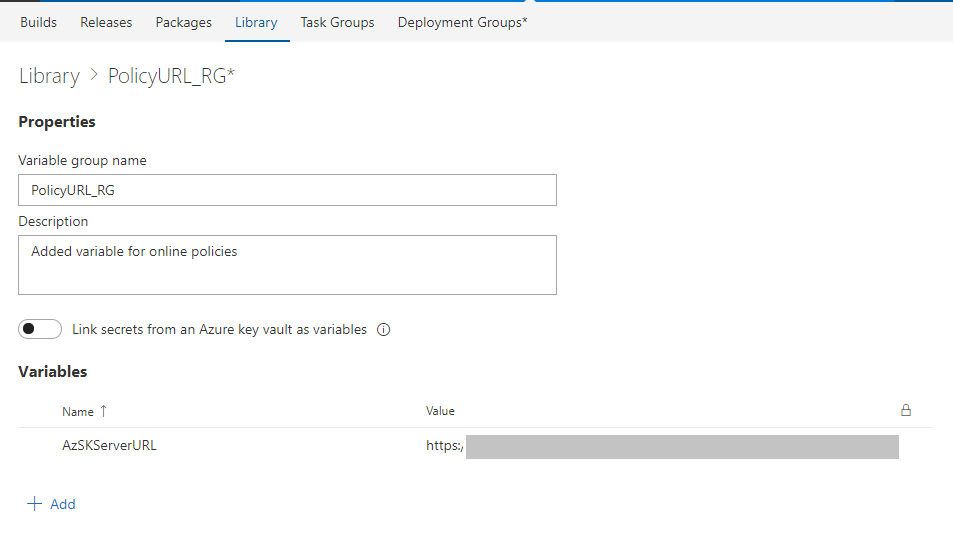
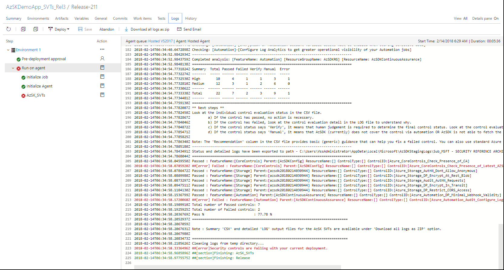

# Security Verification Tests (SVTs) in CICD Pipeline

## Contents
- [Overview](Security_In_CICD_userguide.md#overview) 
- [Install AzSDK extension on your VSO](Security_In_CICD_userguide.md#install-azsdk-extension-on-your-vso) 
- [Walkthrough](Security_In_CICD_userguide.md#walkthrough)
  - [Adding SVTs in the release pipeline](Security_In_CICD_userguide.md#adding-svts-in-the-release-pipeline)
  - [Verifying that SVTs have been added and configured correctly](Security_In_CICD_userguide.md#verifying-that-the-svts-have-been-added-and-configured-correctly)
- [Remediating Failures and Next Steps](Security_In_CICD_userguide.md#remediating-failures-and-next-steps)
------------------------------------------------------------------
### Overview 
The AzSDK contains Security Verification Tests (SVTs) for several core components of the Azure platform. As we have seen so far, these SVTs can be manually run against one or more target resources held in resource groups or tagged via a {tagName, tagValue} pair.

While it is valuable to run these SVTs periodically from a PS console to ensure that the subscription and the different resources that comprise your application are in a secure state, a key aspect of DevOps is to be able to automate such tests and integrate them as part of the DevOps workflows and release pipelines.

This feature helps with exactly that by making SVTs available as a Visual Studio Extension in the Marketplace so that engineering teams can run them within build/release pipeline. Once the build/release task is configured, SVTs will run against a target deployment in an Azure subscription. Upon completion, SVTs will report the pass/fail status for controls including pass/fail counts. All the different 'out-of-box' build/release workflow options from VSTS  can be used thereafter as 'next steps' based on the outcomes of SVTs. (For instance, one can decide whether to fail the release outright or to continue despite failures while sending an email to the build/release owners or to hold progress until someone manually approves, etc. Furthermore, SVTs can be included in a pre-prod environment and, if everything passes, the release can be 'promoted' to prod.) 

Outcomes of the SVT execution can also be routed to an OMS workspace configured to receive various events generated by the AzSDK.

[Back to top…](Security_In_CICD_userguide.md#security-verification-tests-svts-in-cicd-pipeline)

### Install AzSDK extension on your VSO

This extesion is currently kept as private. If you are interesed in enabling this extension on you VSO. Please drop a mail to <a href="mailto:azsdksupext@microsoft.com?subject=Request:Enable AsSDK extension for VSO">AzSDK Support</a> with your VSO instance url. We shall share the extension with your instance.

### Walkthrough
This part assumes that you are familiar with VS build tasks and pipelines at a basic level. To demonstrate the capability of the feature, we will use a basic MVC Web App that is checked into our trial repository. Our goal is to show how SVTs can be injected into the build/release workflow so that security testing for Azure subscription and resources is seamlessly integrated into CICD.

[Back to top…](Security_In_CICD_userguide.md#security-verification-tests-svts-in-cicd-pipeline)
### Adding SVTs in the release pipeline

**Step-1:** Create a release definition or open an existing one.  
(Note: Here we will edit "AzSDKDemoApp_SVTs_Rel3" which is part of our test instance of VSTS…we also have a default build definition upstream to this which we isn't shown here as that is a pretty standard web app build flow using an MSBuild task.)  
As shown below, currently the release definition is configured to simply deploy a web app upon building it to a particular app service at the given URL. We will add the SVT task next.

**Step-2:** Add the AzSDK release task corresponding to SVTs.  
Click on "Add Tasks", and select "AzSDK Security Verification Test".  
(Note: To try this in 1ITVSO, this currently requires 1ITVSO admin approval. We have submitted a request to the 1ITVSO team to approve the extension…after that it will become available for all teams. However, in the meantime, the below should work seamlessly in a private/test VSO instance.)  
Click on "Add" and "Close". (The VSO dialog doesn't provide a good visual indication but the task does get added when you click "Add" once!)

**Step-3:** Specify the input parameters for the SVT task.  
The "AzSDK_SVTs" task start showing in the "Run on Agent" list and displays some configuration inputs that are required for the task to run. These are none other than the familiar options we have been specifying while running the AzSDK SVTs manually - you can choose to specify the target resource group(s) or a {tagname, tagvalue} pair based on how your application's resources are organized.  
When the pipeline executes, SVTs will run against the specified target resources.

**Step-4** (optional): Setup connectivity from CICD to OMS.  
(You can skip this step in a first pass exploration of CICD integration of SVTs. This feature enables you to route the SVT results to an OMS workspace.)  
You can also provide a target OMS workspace that SVTs can use to route the security test results from the CICD pipeline. That way, each time SVTs run in CICD, the AzSDK events generated will be sent to the OMS repository and become available for subsequent queries, actions, alerts, etc. in the context of the OMS workspace. (The AzSDK includes an OMS solution pack that can be leveraged towards these 'single dashboard security views'.)  
  
Below, we have added config info of a trial OMS workspace used by the AzSDK team. You should choose your own target OMS workspace and the corresponding resource group instead. (You can use Get-AzureRmOperationalInsightsWorkspace cmdlet to quickly find out the resource group corresponding to your OMS workspace.)   
  
The OMS workspace information may be provided using one of 2 options:  
**Option-1:** Use a 'variable group'  
In this option, a single variable group may be defined at a VSO level to represent the OMS workspace that a collection of projects want to share. This variable group may be 'linked' from the individual build/release definitions across these projects. The benefit is that, in future, if a key value changes, you just have to make that change in one place and all definitions will immediately reflect the change.

The images below show this option. It involves 2 steps:  
1. 	 Create a variable group that holds the OMS info (if one doesn't exist for your org) 
2. 	 Link that variable group to your project's release definition

The variable group name can be a unique name you can choose (and specify in the release task definition). The specific variable names for workspace ID and shared key have to be exactly as shown below. The values of these should correspond the corresponding info for your OMS workspace.  
  
Creating the variable group:

Linking to the release definition:

Note: Variable groups can only be modified or added from the Library under VSO instance.

**Option-2:** Directly use variables in individual build definitions.
 

Important: Ensure that the variable names used are exactly as above and the values correspond to *your* OMS workspace. Moreover, when you specify the OMS shared key, click on the 'lock' icon next to it so that it gets masked.

**Step-5**(optional): Setup Online Policies URL  
(You may skip this step in a first-pass exploration of CICD integration of SVTs. This feature enables you to set up online policies.)  

Below, we have added configuration info of 'AzSDKServerURL' used by the AzSDK team.  

The online Policy URL information may be provided using one of 2 options:  

**Option-1**: Use a 'variable group'  
In this option, a single variable group may be defined at a VSO level to represent the Policy URL that a collection of projects want to share. This variable group may be 'linked' from the individual build/release definitions across these projects. The benefit is that, in future, if a key value changes, you just have to make that change in one place and all definitions will immediately reflect the change.  

The images below show this option. It involves 2 steps:  
1. Create a variable group that holds the URL info (if one doesn't exist for your org) 
2. Link that variable group to your project's release definition

The variable group name can be a unique name you can choose (and specify in the release task definition). The specific variable name for Policy URL  has to be exactly as shown below.   
Creating the variable group:  
    

Linking to the release definition:    
 
> Note: Variable groups can only be modified or added from the Library under VSO instance.

**Option-2**: Directly use variables in individual build definitions.  
    

**Step-6**: Save the Release Definition.
  
  

[Back to top…](Security_In_CICD_userguide.md#security-verification-tests-svts-in-cicd-pipeline)
### Verifying that the SVTs have been added and configured correctly
**Step-1:** Start the release pipeline. 
This can be done by adding a new release for an existing build (or trigger a new release via a minor/trial check-in) 

**Step-2:** Verify that the release pipeline has started. 
Once the release is triggered, we can see that it is in progress by clicking on "Releases" (or via "Build & Release" menu in the VSTS menu).

**Step-3:** View the release outcome.  
In a few minutes the release pipeline should complete and we can view the outcomes as shown below (in the pic below we can see that the release pipeline has failed):

**Step-4:** Look at the "Issues" to see why the release failed.  
The summary output shows the cause of failure (in this case it is because the AzSDK SVTs have failed)

**Step-5:** Look at the complete output log of the AzSDK portion of the release pipeline execution . 
Clicking on the "Security controls are failing…" text (in the pic above) and, further, clicking on the "AzSDK_SVTs" link (in the pic below) will show the details about the SVT execution and failures. Notice how the output is the same as what is displayed when SVTs are manually run in a PS console.

**Step-6:** See the summary "CSV" and detailed "LOG" output files for the AzSDK SVTs.  
This is no different than the "manual SVT run" scenarios. Note, above, how the SVT outputs the location of the "CSV" file and the "LOG" file at the end of the run. However, those locations are on the release agent machine. These are also packaged up in an overall ZIP file and are available to download. The overall ZIP file can be downloaded by clicking on the "Download all logs as ZIP" option.  
The ZIP file "ReleaseLogs_dd.zip" contains LOGs from the entire release pipeline…including the master output for the AzSDK_SVTs. The CSV file and the LOG file for AzSDK SVTs are embedded in the 'inner' ZIP file that is named according to the parameterSet chosen to run the SVTs (in the pic below the ZIP file is named by the target resource group that we used 'mptestrg').

 

Opening/extracting the "AzSDK_Logs" ZIP file will reveal the identical folder structure and files placement as we have seen in the case of manual SVT runs:

[Back to top…](Security_In_CICD_userguide.md#security-verification-tests-svts-in-cicd-pipeline)
### Remediating Failures and Next Steps
Once you have the CSV file and the LOG file for the SVTs execution, the process of understanding and remediating failures is no different than what is used when SVTs are run manually. Basically, you will need to look at the failed SVTs in the CSV file and the corresponding details about 'what exactly caused each individual failure' in the LOG file. Thereafter the issue can be remediated (additional guidance available from AzSDK is at the link in the CSV file for each row).  
If you chose to route events to OMS, then, you can also use the AzSDK Solution Pack for OMS to view things like "build/release security health", long term trends, configure and receive alerts for various conditions (e.g., back to back SVT failures) etc.

[Back to top…](Security_In_CICD_userguide.md#security-verification-tests-svts-in-cicd-pipeline)
