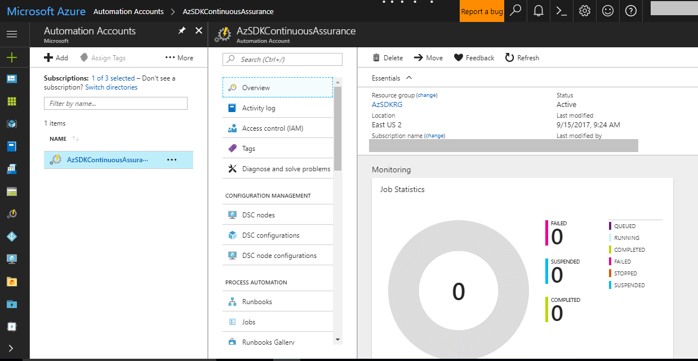
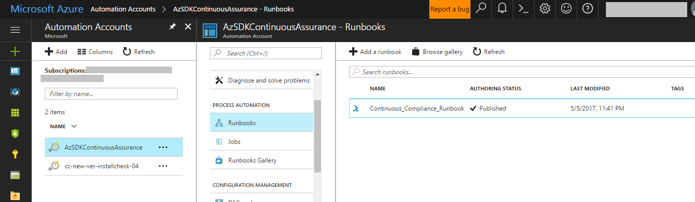
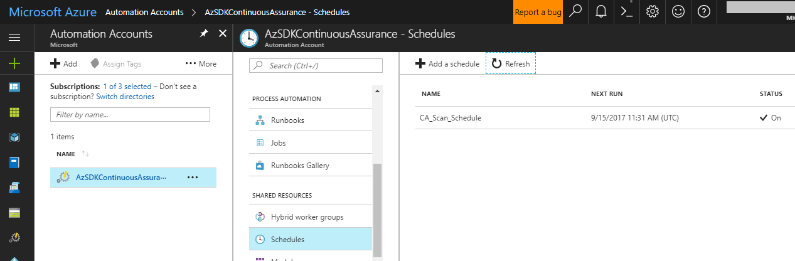
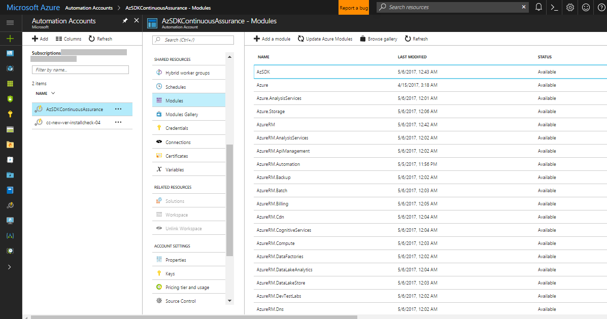
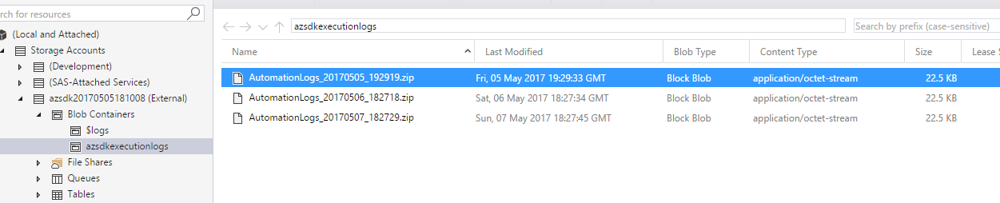
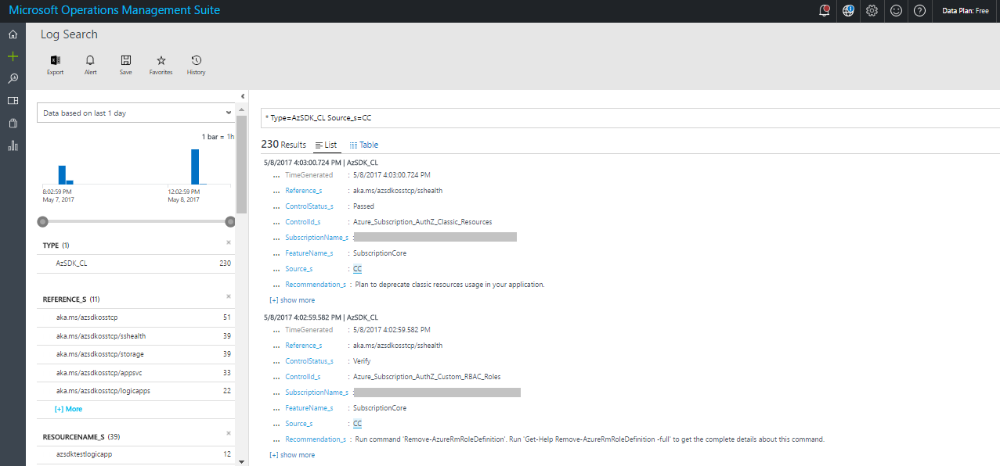

# Baseline Continuous Assurance
### Contents
- [Overview](Continuous_Assurance_userguide.md#overview)
- [Setting up Continuous Assurance - Step by Step](Continuous_Assurance_userguide.md#setting-up-continuous-assurance---step-by-step)
- [Continuous Assurance - how it works (under the covers)](Continuous_Assurance_userguide.md#continuous-assurance---how-it-works-under-the-covers)
- [Update existing Continuous Assurance Automation Account](Continuous_Assurance_userguide.md#update-existing-continuous-assurance-automation-account)
- [Remove Continuous Assurance Automation Account](Continuous_Assurance_userguide.md#remove-continuous-assurance-automation-account)
- [Fetch details of an existing Continuous Assurance Automation Account](Continuous_Assurance_userguide.md#fetch-details-of-an-existing-continuous-assurance-automation-account)
- [FAQ](Continuous_Assurance_userguide.md#faq)

-----------------------------------------------------------------
### Overview 
The basic idea behind Continuous Assurance (CA) is to setup the ability to check for "drift" from what is considered a secure 
snapshot of a system. Support for Continuous Assurance lets us treat security truly as a 'state' as opposed to a 'point in time' 
achievement. This is particularly important in today's context when 'continuous change' has become a norm.

There can be two types of drift: 
1. Drift involving 'baseline' configuration:
This involves settings that have a fixed number of possible states (often pre-defined/statically determined ones). For instance, a SQL DB can have TDE encryption turned ON or OFF…or a Storage Account may have auditing turned ON however the log retention period may be less than 365 days. 	 
2. Drift involving 'stateful' configuration: There are settings which cannot be constrained within a finite set of well-known states. For instance, the IP addresses configured to have access to a SQL DB can be any (arbitrary) set of IP addresses. In such scenarios, usually human judgment is initially required to determine whether a particular configuration should be considered 'secure' or not. However, once that is done, it is important to ensure that there is no "stateful drift" from the attested configuration. (E.g., if, in a troubleshooting session, someone adds the IP address of a developer machine to the list, the Continuous Assurance feature should be able to identify the drift and generate notifications/alerts or even trigger 'auto-remediation' depending on the severity of the change). 

Besides 'drift tracking' there are also two other aspects of "staying secure" in operations. First of them is 
the simple concept that if new, more secure options become available for a feature, it should be possible to detect that 
a particular application or solution can benefit from them and notify/alert the owners concerned. In a way this can be thought 
of as facilitating "positive" security drift. The other aspect is about supporting "operational hygiene". In this area, 
we will add the ability to remind an app team about the security hygiene tasks that they need to periodically 
perform (key rotation, access reviews,  removing inactive/dormant power users, etc.). These two capabilities are on our backlog for H1-FY18.

>**Note**: If you have already installed Continuous Assurance Automation Account (Name: AzSDKCCAutomationAccount) using a version prior to 2.2, 
you should run 'Install-AzSDKContinuousAssurance' command again by following the steps in the next section.


[Back to top…](Continuous_Assurance_userguide.md#contents)
### Setting up Continuous Assurance - Step by Step
In this section, we will walk through the steps of setting up a subscription and application(s) for Continuous Assurance coverage. 
To get started, we need the following:
1. The user setting up Continuous Assurance needs to have 'Owner' access to the subscription. (This is necessary because during setup, 
AzSDK adds the automation account as a 'Reader' to the subscription.)

2. Target OMS WorkspaceID* and SharedKey. (The OMS workspace can be in a different subscription, see note below)


> **\*Note** CA leverages an OMS repository for aggregating security scan results, you must determine which OMS workspace 
you will use to view the security state of your subscription and applications (If you don't have an OMS repository please 
follow the steps in [Setting up the AzSDK OMS Solution](../05-Alerting-and-Monitoring/Alert_Montoring_userguide.md) ). 
This can be a single workspace that is shared by multiple applications which may themselves be in different subscriptions. 
Alternately, you can have an OMS workspace that is dedicated to monitoring a single application as well. 
(Ideally, you should use the same workspace that is being used to monitor other aspects like availability, performance, etc. 
for your application.)


**Step-1: Setup**  
0. Setup the latest version of the AzSDK following the installation instructions for your organization. (For MSIT use http://aka.ms/azsdkdocs).
1. Open the PowerShell ISE and login to your Azure account (using **Login-AzureRmAccount**).  
2. Run the '**Install-AzSDKContinuousAssurance**' command with required parameters given in below table. 

```PowerShell
	Install-AzSDKContinuousAssurance -SubscriptionId <SubscriptionId> `
		[-AutomationAccountLocation <AutomationAccountLocation>] `
	        -ResourceGroupNames <ResourceGroupNames> `
	        -OMSWorkspaceId <OMSWorkspaceId> `
	        -OMSSharedKey <OMSSharedKey> `
	        [-AzureADAppName <AzureADAppName>]
```

|Param Name|Purpose|Required?|Default value|Comments|
|----|----|----|----|----|
|SubscriptionId|Subscription ID of the Azure subscription in which an Automation Account for Continuous Assurance will be created |TRUE|None||
|AutomationAccountLocation|(Optional) The location in which this cmdlet creates the Automation Account|FALSE|EastUS2|To obtain valid locations, use the Get-AzureRMLocation cmdlet|
|ResourceGroupNames|Comma separated list of resource groups within which the application resources are contained.|TRUE|None||
|OMSWorkspaceId|Workspace ID of OMS which is used to monitor security scan results|TRUE|None||
|OMSSharedKey|Shared key of OMS which is used to monitor security scan results|TRUE|None||
|AzureADAppName|(Optional) Name for the Azure Active Directory(AD) Application that will be created in the subscription for running the runbooks. |FALSE|None||

**More about the 'AzureAdAppName' parameter:**

The AzureADAppName parameter is optional. This represents the runtime account that will be used by the
CA runbook to scan the subscription/resources. 
- If the user does not specify a parameter, then CA will: 
    - Find if there is an existing AAD app (from a previous attempt to setup CA) in the subscription that can be reused.
    - Else, create a fresh Azure AD app on behalf of the user (in this case the user must have permission to create apps in the tenant).
- If the user specifies an AzureADAppName, then CA will try to find the AAD application corresponding to that 
name and attempt to use it (in this case the user must have 'Owner' permission on the specified app name). 

Here's a quick summary of the permissions required for the user who sets up CA:
- "Owner" access on the subscription
- Ability to create an AAD app in the tenant (this app is used as the runtime account for scanning via the CA runbook)
- "Owner" acceess to the AAD app if the user specifies one (or CA internally finds a previously created one)


**Note-1**: Completion of this one-time setup activity can take up to 2 hours. (This is because one of the things that setup does 
is download and add PowerShell modules for Azure PS library and for AzSDK. This is a slow and sometimes flaky process and, 
as a result, the setup internally retries failed downloads. The Azure Automation product team is aware of this challenge and are working on a resolution.)


**Note-2**: Due to the complexity of various dependent activities involved, there are multiple places where CA setup can get tripped up. 
It is important to verify that everything has worked without hiccups. Please review and ascertain each of the "Verifying" steps below carefully.


**Step-2: Verifying that CA Setup is complete**  
**1:** In the Azure portal, select the application subscription that was used above and search for resources of type Automation Account. You should see an Automation Account created by the name 'AzSDKContinuousAssurance'. Clicking on it will display the contents of the Automation Account (something that looks like the below, the counts shown may vary a little):

 

**2:** Click on the 'Assets' tile for the Automation Account and select 'Modules'. It should show 'Status' column value for all modules as 'Available' (The counts shown may vary).

 
	
**3:** Click on 'Runbooks' tile. It should show the following runbook:

 

**4:** Click on 'Schedules' tile. It should show the scheduling details of runbook. You can change the schedule timings according to your need. Default schedule is created as below. First job will run ten minutes after the installation:

 

**5:** Click on 'Run As Accounts' tile. It should show the following account:

 

**Step-3: Verifying that all required modules are downloaded successfully (after about two hours of starting the installation)**

**1**: Click on the 'Modules' tile for the Automation Account. 'AzSDK' module should be listed there. 'Status' column value for all modules should be 'Available' as below.

 
 
**Step-4: Verifying CA Runbook execution and OMS connectivity**  
Once CA setup and modules download are completed successfully, the runbooks will automatically execute periodically (once a day) and scan the subscription and the specified resource groups for the application(s) for security issues. The outcomes of these scans will get stored in a storage account created by the installation (format : azsdk\<YYYYMMDDHHMMSS> e.g. azsdk20170505181008) and follows a similar structure as followed by standalone SVT execution (CSV file, LOG file, etc.).    

The results of the control evaluation are also routed to the OMS repository for viewing via a security dashboard.  
  
Let us verify that the runbook output is generated as expected and that the OMS connectivity is setup and working correctly.

**1:** Verify that CSV file and LOG file are getting generated as expected.  
 
1. Go to Storage Explorer and look for a storage account with a name in azsdk<YYYYMMDDHHMMSS> format in your subscription in 'AzSDKRG' resource group.
2. Find a container called 'azsdkexecutionlogs' in this storage account.
3. There should be a ZIP file named using a timestamp based on the date time for the manual execution in this container (most likely the ZIP file with the most recent creation date). 
4. Download the ZIP file and extract its contents locally. The folder structure will be similar to how SVTs/Subscription Health scan generate when run locally. 
5. In a single zip file you will find two folders (name format: Timestamp). One folder contains reports of Subscription Health scan and another folder contains reports of application(s) resource groups security scan.
	
 

**2:** Verify that data is being sent to the target OMS workspace   

1. Go to the OMS dashboard that we used to setup CA above.
2. In the 'Search' window, enter Type=AzSDK_CL Source_s=CC. Source will be changed to 'CA' in future.
3. You should see results similar to the below:
	
 

Once CA is setup in the subscription, an app team can start leveraging the OMS Solution from AzSDK as a one-stop dashboard 
for visibility of security state. Please follow the steps in the OMS solution setup (in Alerting & Monitoring sub-section of 
this notebook) to enable that part.

[Back to top…](Continuous_Assurance_userguide.md#contents)
### Continuous Assurance - how it works (under the covers)
The CA feature is about tracking configuration drift. This is achieved by enabling support for running AzSDK 
SVTs/SS-Health via automation runbook. 

The CA installation script that sets up CA creates the following resources in your subscription:

- Resource group (Name : AzSDKRG) :- 
To host all the Continuous Assurance artifacts
- Storage account (Format : azsdkYYYYMMDDHHMMSS) :- To store the daily results of CA scans. The storage account is named with a timestamp-suffix applied to 'azsdk'(e.g. azsdk20170420111140)
- Azure AD App and Service Principal :- This is used as the runtime identification of the automation runbook. Adds SPN to 'Reader' role on the subscription and contributor role on the resource group containing Automation Account.
- Automation Account (Name : AzSDKContinuousAssurance) :- Creates the following assets within the Automation Account,
   - Runbook (Name : Continuous_Assurance_Runbook) - To download/update Azure/AzSDK modules and scan subscription/app resource groups  
   - Variables 
      - AppResourceGroupNames 
      - OMSWorkspaceId 
      - OMSSharedKey 
      - ReportLogsStorageAccountName
   - Azure Run As Account - To authenticate runbook at runtime  
      This account uses below certificate and connection.  
      AzureRunAsCertificate - This certificate gets expired after six months of installation  
      AzureRunAsConnection - This connection is created using service principal with a AzureRunAsCertificate
   - Two schedules to trigger the runbook :-
      - Scan_Schedule - This is to trigger job to scan subscription and app resource groups
      - Next_Run_Schedule - This is temporary schedule created by runbook to retry download of modules
   - Modules - Downloaded by the runbook
   
About 63 assets are created overall.

#### Next Steps
Once CA is setup in the subscription, an app team can start leveraging the OMS Solution from AzSDK as a one-stop dashboard for visibility of security state.
Occasionally, you may also feel the need to tweak the configuration of CA. See the "Update" section below about how to do that.

[Back to top…](Continuous_Assurance_userguide.md#contents)
### Update existing Continuous Assurance Automation Account
The '**Update-AzSDKContinuousAssurance**' command can be used to make changes to a previously setup CA configuration.
For instance, you may use it to:
- update the target resource groups to include in the scanning
- switch the OMS workspace information that CA should use to send control evaluation events to
- use a different AAD SPN for the runbooks 
- etc.

To do any or all of these:
1. Open the PowerShell ISE and login to your Azure account (using **Login-AzureRmAccount**).  
2. Run the '**Update-AzSDKContinuousAssurance**' command with required parameters given in below table. 

```PowerShell
Update-AzSDKContinuousAssurance -SubscriptionId <SubscriptionId> `
    [-ResourceGroupNames <ResourceGroupNames>] `
    [-OMSWorkspaceId <OMSWorkspaceId>] `
    [-OMSSharedKey <OMSSharedKey>] `
    [-AzureADAppName <AzureADAppName>] `
    [-UpdateCertificate]
```

|Param Name|Purpose|Required?|Default value|Comments
|----|----|----|----|----|
|SubscriptionId|Subscription ID of the Azure subscription in which Automation Account exists |TRUE|None||
|ResourceGroupNames|Use this parameter if you want to update the comma separated list of resource groups within which the application resources are contained. The previously configured list of RGs will be replaced with the one provided here.|FALSE|None||
|OMSWorkspaceId|Use this parameter if you want to update the workspace ID of OMS which is used to monitor security scan results|FALSE|None||
|OMSSharedKey|Use this parameter if you want to update the shared key of OMS which is used to monitor security scan results|FALSE|None||
|AzureADAppName|Use this parameter if you want to update the connection (used for running the runbook) with new AD App and Service principal|FALSE|None|This is useful if existing connection is changed/removed by mistake|
|UpdateCertificate|Use this switch to renew/update certificate. This is useful when certificate gets expired after six months of installation|FALSE|None||

[Back to top…](Continuous_Assurance_userguide.md#contents)
### Remove Continuous Assurance Automation Account
1. Open the PowerShell ISE and login to your Azure account (using **Login-AzureRmAccount**).  
2. Run the '**Remove-AzSDKContinuousAssurance**' command as below. 

```PowerShell
Remove-AzSDKContinuousAssurance -SubscriptionId <SubscriptionId>  [-DeleteStorageReports] 
```
|Param Name |Purpose |Required?	|Default value	|Comments|
|-----|-----|-----|----|-----|
|SubscriptionId	|Subscription ID of the Azure subscription in which Automation Account exists |TRUE |None||	 
|DeleteStorageReports |Add this switch to delete AzSDK execution reports from storage account. 
This will delete the storage container where reports are stored. Generally you will not want to use this option as all previous scan reports will be purged. |FALSE |None||	

[Back to top…](Continuous_Assurance_userguide.md#contents)
### Fetch details of an existing Continuous Assurance Automation Account
1. Open the PowerShell ISE and login to your Azure account (using **Login-AzureRmAccount**).  
2. Run the '**Get-AzSDKContinuousAssurance**' command as below. 
```PowerShell
Get-AzSDKContinuousAssurance -SubscriptionId <SubscriptionId> 
```
**Note:** This command is compatible only for Automation Account installed after 5th May, 2017 AzSDK release.

[Back to top…](Continuous_Assurance_userguide.md#contents)
### FAQ
#### Troubleshooting
Please reach out to us at AzSDKSupExt@microsoft.com if you face any issues with this feature.  
[Back to top…](Continuous_Assurance_userguide.md#contents)
