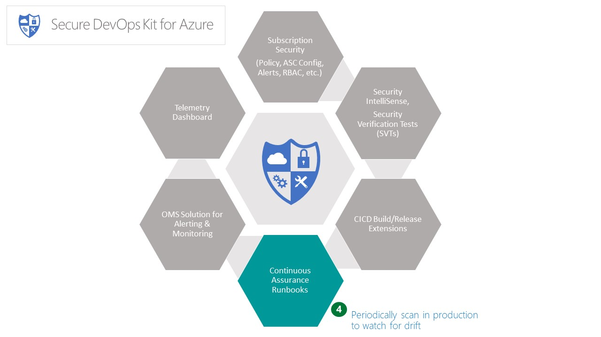

# Continuous Assurance (CA)

The Continuous Assurance feature set aims to achieve the following objectives: 
1. 	 Provide assurance that security state of an Azure subscription and one or more applications isn’t ‘drifting’ in the wrong direction.
2. 	 Create support for staying up to speed with security improvements of Azure services. 
3. 	 Encourage adherence to operational best practices such as key rotation, separation of duties, etc.

This will be accomplished through one or more tools that cover the following - 
- 	 Maintaining baseline security compliance for a subscription and for application resources
- 	 Application specific 'security snapshot' and 'drift tracking' 
- 	 Support for 'auto-heal' in for critical configuration settings.
- 	 Operational support for important security hygiene activities 
	
