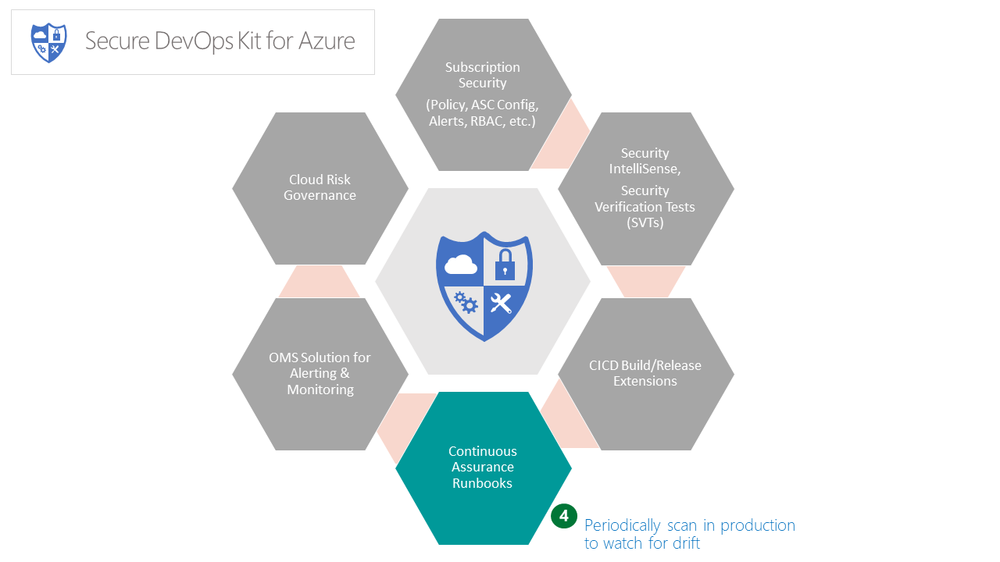

# Continuous Assurance (CA)

The Continuous Assurance (CA) feature has the following objectives: 
1. 	 Provide assurance that security state of an Azure subscription and one or more applications isn’t ‘drifting’ in the wrong direction.
2. 	 Create support for staying up to speed with security improvements of Azure services. 
3. 	 Encourage adherence to operational best practices such as key rotation, separation of duties, etc.

To accomplish these, this area adds the following capabilities to the AzSDK:  
- 	 Ability to create application specific 'security snapshot' of configuration
-    Ability to periodically scan the application's Azure subscription and resources
-    Ability to channel the outcomes of control evaluation to monitoring subsystems.
- 	 Support for operational security hygiene activities 
	
For more details, please refer [here](Continuous_Assurance_userguide.md).
