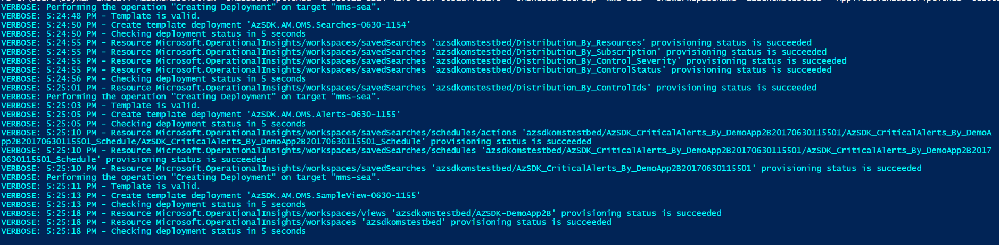

# OMS Solution for AzSDK
 ### Contents
- [Overview](Alert_Montoring_userguide.md#overview)
- [Routing AzSDK events to OMS](Alert_Montoring_userguide.md#routing-azsdk-events-to-oms)
- [Contents of the AzSDK OMS Solution](Alert_Montoring_userguide.md#contents-of-the-azsdk-oms-solution)
- [Setting up the AzSDK OMS Solution (Step by Step)](Alert_Montoring_userguide.md#setting-up-the-azsdk-oms-solution-step-by-step)
- [Next Steps](Alert_Montoring_userguide.md#next-steps)

--------------------------
### Overview 
The OMS solution for AzSDK provides the ops team with a single dashboard to view the security state/trends of one or more of the following:
- Subscription and Application state/trends in early development stages 
- Subscription and Application state/trends in CICD pipelines as reported by AzSDK SVTs
- Subscription and Application state/trends as reported via AzSDK continuous compliance runbooks

[Back to top…](Alert_Montoring_userguide.md#contents)

### Routing AzSDK events to OMS
Note that the Security Verification Tests (SVTs) from AzSDK can be run in 3 stages:
1. Development ("SDL")
2. Build/Deployment ("CICD")
3. Continuous Assurance ("CC")

Depending on the stage the way to wire up the SVTs/runbooks with OMS is different. 

1. In the development ("SDL") stage, the following command can be used to set the OMS workspace that will collect events generated via various AzSDK-scripts/SVTs etc. in a subscription:

```PowerShell
 Set-AzSDKOMSSettings -OMSWorkspaceID <OMSWorkspaceID> -OMSSharedKey <OMSSharedKey>
```

2. In the CICD stage, the OMS settings can be specified in the input parameters for the [AzSDK SVTs build/release task](../03-Security-In-CICD/Security_In_CICD_userguide.md).
3. For the CC runbooks, the OMS workspace info specified in the input parameters of the [Continuous Assurance setup script](../04-Continous-Assurance/Continuous_Assurance_userguide.md).  

Events sent from these (different devops) stages of one or more applications get aggregated in the OMS workspace alongside events from the various out-of-box solution packs available in the OMS gallery. The OMS solution for AzSDK leverages the out-of-box solution packs (such as Log Analytics, Alerts, etc.) and AzSDK events to provide an overall view of security across the different DevOps stages for these applications. The picture below shows a conceptual view of this.  


[Back to top…](Alert_Montoring_userguide.md#contents)

### Contents of the AzSDK OMS Solution
The OMS solution is basically an ARM template that an end user can deploy on the subscription where the OMS workspace resides. Based on a few key inputs provided by the end user, the solution creates a template deployment which builds and sets up all the necessary artifacts required for security state visibility and monitoring.

The out of box security dashboard generated by the OMS solution enables scenarios such as the following:
1. Summary view of critical tasks that require immediate attention
2. Outcomes of the most recent 'Continuous Compliance' scans
3. Summary of recent RBAC activity (important role assignments, access revocation, etc.)
4. Trends of various security metrics and activity over time

**A- View of tiles in the main dashboard**


**B- Subscription Security View**
	


**C- Application Security View**


[Back to top…](Alert_Montoring_userguide.md#contents)

### Setting up the AzSDK OMS Solution (Step by Step)
This section will walk you through the step-by-step experience of setting up the AzSDK OMS solution. The workflow involves two sets of steps - one set to be run by the central PU team that owns the OMS workspace and the other set to be run by the application team (for apps which are to be monitored via the central OMS dashboard). We will refer to the central BU team as the "**Ops team**" and the application team as "**App team**" below.

**Note**: In a single/small team scenario, both of these personas could be the same person/group and the OMS subscription could be the same as the application subscription. These steps should still apply.

The general model this assumes is one where there are (1) multiple subscriptions covering a portfolio of applications for a BU and (2) a central subscription that hosts the OMS workspace for that BU. We call the former 'app subscriptions' and the latter 'OMS subscription'.

At a high level, we will be performing the following steps:
1. Create an OMS workspace in the central subscription
2. Configure the app subscription to send events to this OMS workspace
3. Install the AzSDK OMS Solution Pack in the OMS workspace
4. View security status/alerts/etc.

**Step-1 (Ops team):** Create a new OMS workspace.
Go to https://mms.microsoft.com and follow the simple steps to create a new OMS workspace.
	


**Note:** If you already have an OMS workspace, then that can be used as well (i.e., you don't have to create a fresh one just for the AzSDK solution pack). Indeed, the idea is that the security views appear alongside other views on the operations dashboard and not in a standalone one.

**Step-2 (Ops Team):** Associate with an Azure Subscription. This should be the central subscription that is to host the OMS workspace.

  

**Step-3 (Ops Team):** Capture the WorkspaceID and PrimaryKey for the workspace by clicking on "Settings" for the OMS workspace and navigating to "Connected Sources -> Windows Servers".


As an aside, after concluding setup for the OMS workspace, you will also get an email for email address confirmation such as the one below:


	
**Step-3x: (Ops Team)** Add Alert Management Solution Pack from OMS Solution Gallery (choose default installation) in the OMS subscription.


	
**Step-3y: (Ops Team)** Add Activity Log Analytics Solution Pack from the gallery (see pic above) and configure it (steps below).
After you install the Activity Log Solution Pack from the gallery, it's dashboard tile directs you to do connect a log source as shown below:
	


1. This connection is setup in the OMS subscription by going into the Log Analytics feature and clicking on "Azure Activity Log" in the Workspace Data Sources list as below:

  

2. From the OMS Subscription, one can view all subscriptions that the Ops team person (current user) has at least "Reader" level access as options for 'Connecting' to Log Analytics pack. It means that App team subscriptions will show here as an option only if at least "Reader" access is granted to the current OMS user. (This is an OMS product requirement.)  

Choose the subscription(s) corresponding to the apps that are being monitored and click 'Connect'.
      

	
Note: The above steps have to be done from the OMS subscription.

At this point, the app subscription is setup to pipe it's Activity Log events to the OMS workspace. 

In the next 2 steps we will configure AzSDK to send data to the OMS workspace from a PS session. This is just so that we can verify that custom events that AzSDK generates are getting to OMS correctly. 

**Step-4 (App Team):** Connect the application subscription to the above OMS workspace for sending AzSDK events.
Run the below code in a PS session after logging in to Azure (assumes you also have the latest AzSDK installed).
```PowerShell
 $wsID = 'oms_workspace_id_here'
 $shrKey = 'workspace_sharedKey_here'
	
 Set-AzSDKOMSSettings -OMSWorkspaceID $wsID -OMSSharedKey $shrKey
```
After doing so, AzSDK cmdlets, SVTs, etc. will chart sending events (outcomes of security scans) into the OMS repository represented by the workspaceID above.

**Step-5 (App Team):** Run a few AzSDK cmdlets to generate events for the OMS repo. 
This can be done by running one or both of the below:
```PowerShell
 Get-AzSDKSubscriptionSecurityStatus -SubscriptionId $subID 
 Get-AzSDKAzureServicesSecurityStatus -SubscriptionId $subID -ResourceGroupName 'app_rg_name'
```

After the above, if we go into OMS Log Search and search for 'AzSDK_CL', it should show events similar to the below ("_CL" stands for "custom log"):
	


**Step-6 (Ops Team):** Prepare to install the AzSDK OMS Solution Pack. Configure the installation parameters.
Create a copy of the following file from the AzSDK setup folder under %user%\Documents\WindowsPowerShell\Modules\AzSDK\Framework\Configurations\AlertMonitoring\AzSDK.AM.OMSSetup.Params.json

	
Edit your copy of this file (e.g., MySetupParams.json) and change the location, resourceGroup, subscriptionId, subscriptionName and workspaceName to correspond to the above OMS workspace. 
	    


|       |      |
| ----- | ---- | 
|omsWorkspaceLocation|location of the workspace, without space|
|omsResourcegroup|name of the resource group where the OMS Workspace is in|
|omsSubscriptionId|ID of the subscription where the OMS Workspace is in|
|appSubscriptionName|Name of the subscription where the Application resourcegroup is located|
|omsWorkspaceName|Name of the OMS workspace|
|omsWorkspaceApiVersion|Leave as it is|
|alertEmailsPointOfContact|Edit to add at least one email address.|

**Notes:**
- Use `Get-AzureRMLocation` command to find the location code for your OMS location. Displayname of the location is not supported as a valid value (e.g., 'southeastasia' is location code and display name is 'Southeast Asia').
- For the alertEmailsPointOfContact configure who you'd like to receive security-related alerts for the apps covered by this OMS workspace.

**Important:** Do not copy the values from the picture above as those correspond to our demo workspace. You need to find the corresponding values for your Ops team OMS workspace. These can be determined by running the following cmdlet in the *Ops team* subscription:
```PowerShell
 Get-AzureRmOperationalInsightsWorkspace 
```

The output from that command should look like the below (showing the OMS workspaces from the subscription that is currently chosen in PS via **Set-AzureRmContext**):


**Step-7 (Ops Team): AzSDK OMS Solution Pack - Subscription View**
```PowerShell
 $paramFilePath = 'full_path_to\MySetupParams.json'
 $omsRG = 'resource_group_of_oms_workspace'
 $omsSubId = 'subscription_id_of_oms_workspace'
	
 Install-AzSDKOMSSecurityPack -SubscriptionId $omsSubId -OMSResourceGroupName $omsRG -OMSSubCCParamFilePath $paramFilePath
```

(A resource group name looking like 'mms-xxx' is used by the default OMS setup process (where 'xxx' can be 'eus' or 'sea' etc. based on the region). If you specified a custom resource group name, then use that for the command above. **The Get-AzureRmOperationalInsightsWorkspace** will show the correct value to use for the respective OMS workspace.)

This will produce output like the below:
	

      
The installation script does the following:
1. Adds an AzSDK-xxx view to the OMS workspace (including a tile for the main OMS dashboard)
2. Adds multiple "Saved Searches" (Work-In-Progress - WIP), 
3. Configures security-related alerts inside the OMS workspace (WIP), 
4. Install various schedules (for the above alerts) (WIP)

At this point, the application's subscription is setup for AzSDK OMS monitoring. We will setup the application itself separately further below.

In the next step, we will look at the subscription view artifacts.


**Step-8 (Ops Team):** Viewing the various artifacts in the AzSDK OMS Solution Pack

**8-(a)** Viewing the events that have come across from the app sub.
Click on the 'magnifier' icon in the taskbar on the left to open the "Log Search" page.
Enter "Type=AzSDK_CL" in the query field.
	
 

You should see the data from the AzSDK cmdlet that were run by the app team (to generate some events in Step-5).


	
**8(b)** AzSDK Solution View
The solution view contains multiple blades representing alerts, various types of security activity, security trends, etc.
	


**8(c)** You can also see the "Saved Searches" installed if you click on the "Favorites" (star) icon just under the "Log Search" title in the Log Search pane:
	


**8(d)** The Alerts that have been configured by the AzSDK OMS Solution Pack can be view in the "Alerts" tab in the Settings  pane:
	


Alert Details, Schedule, EmailID, etc.
	


**Step-9 (Ops Team):** AzSDK OMS Solution Pack - Application View(s)
After setting up the Subscription view, one or more applications from *that* subscription can be configured for AzSDK monitoring. 

Create a copy of the following file located at:  
  
 %user%\Documents\WindowsPowerShell\Modules\AzSDK\Framework\Configurations\AlertMonitoring\AzSDK.AM.OMSSetup.App.Params.json
	


Just like the subscription param file above, edit the following values - resourceGroup, subscriptionId, subscriptionName, applicationName, applicationQuery and workspaceName. Application name here is free form. The applicationQuery should include the resource name for the app. SubscriptionID should correspond to the OMS subscription and the subscriptionName should correspond to the app subscription.


	
|       |      |
| ----- | ---- | 
|omsWorkspaceLocation|location of the workspace, without space|
|omsResourcegroup|name of the resource group where the OMS Workspace is in|
|omsSubscriptionId|ID of the subscription where the OMS Workspace is in|
|appSubscriptionName|Name of the subscription where the Application resourcegroup is located|
|appName|Display Name of your app (how it will show in OMS)|
|appQuery|Change the resourcegroup name "appQuery": { "value": " ( ResourceGroup=\"xygappresourcegroupname1\" OR ResourceGroup=\"xygappresourcegroupname2\"" } You can specify one or more resource groups that needs to monitored.|
|omsWorkspaceName|Name of the OMS workspace|
|omsWorkspaceApiVersion|Leave as it is|
|alertEmailsPointOfContact|Edit to add at least one email address.|

```PowerShell
 $appParamFilePath = 'full_path_to\MyAppSetupParams.json'
 $omsRG = 'resource_group_of_oms_workspace'
 $omsSubId = 'subscription_id_of_oms_workspace'
	
 Install-AzSDKOMSSecurityPack -SubscriptionId $omsSubId -OMSResourceGroupName $omsRG -OMSAppCCParamFilePath $appParamFilePath
```

(A resource group name looking like 'mms-xxx' is used by the default OMS setup process (where 'xxx' can be 'eus' or 'sea' etc. based on the region). If you specified a custom resource group name, then use that for the command above. The Get-AzureRmOperationalInsightsWorkspace will show the correct value to use for the respective OMS workspace.)

Running the Install-xxx cmdlet above will show output such as the following (similar to the subscription view setup cmdlet).
	


After successful installation, an app-specific view such as the below will start appearing in the OMS dashboard….
The name of the app, as set in the parameters JSON in the setup command will be tagged in the view name.


At this point, we can confirm that the ad hoc security scan we ran in Steps 4, 5 above generated data for the application security control status by looking at the view (by clicking the tile above).


	
If you also have CICD integration setup, you can trigger a new deployment and also start seeing the AzSDK control evaluation results from CICD in the OMS workspace (as shown below):


Lastly, if you also setup continuous assurance (AzSDK CC runbooks), you will also see activity in the first blade as shown below:


	

[Back to top…](Alert_Montoring_userguide.md#contents)

### Next Steps
Now you can view, track and respond to security events in one or more applications from the OMS workspace.

WIP - Add some more guidance on setting up alerts/other functions such as Autoheal, etc.

[Back to top…](Alert_Montoring_userguide.md#contents)

