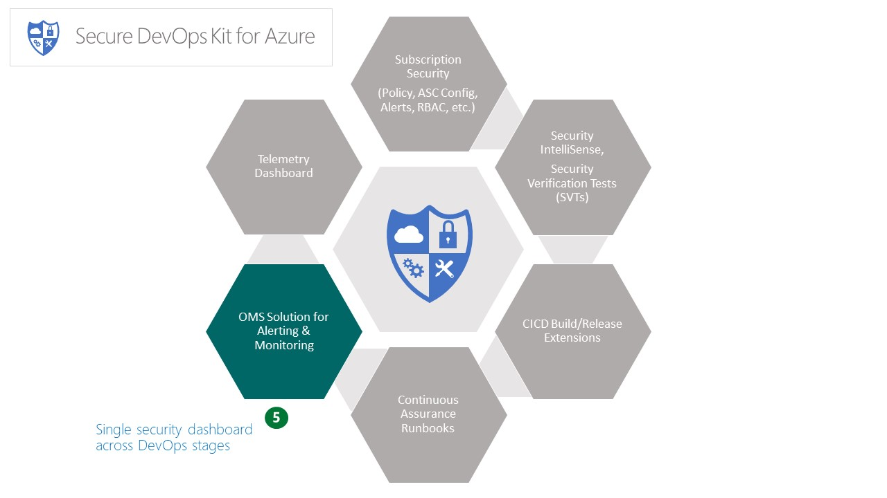

# Alerting & Monitoring

> This page provides a gist of the feature area and capabilities delivered. For details, please refer [here](Alert_Montoring_userguide.md).

Features in the Alerting & Monitoring area empower dev ops team with following: 
1. 	 Provide a single pane of glass view of cloud security across the different stages of dev ops.
2.   Enable the dev ops team to see and act on drift from attested baselines for Azure subscription and resources.
3.   Ability to get notified upon various situations of control drift.
4.   Support for integrating other downstream systems via event hubs, webhooks, PowerBI, etc.

