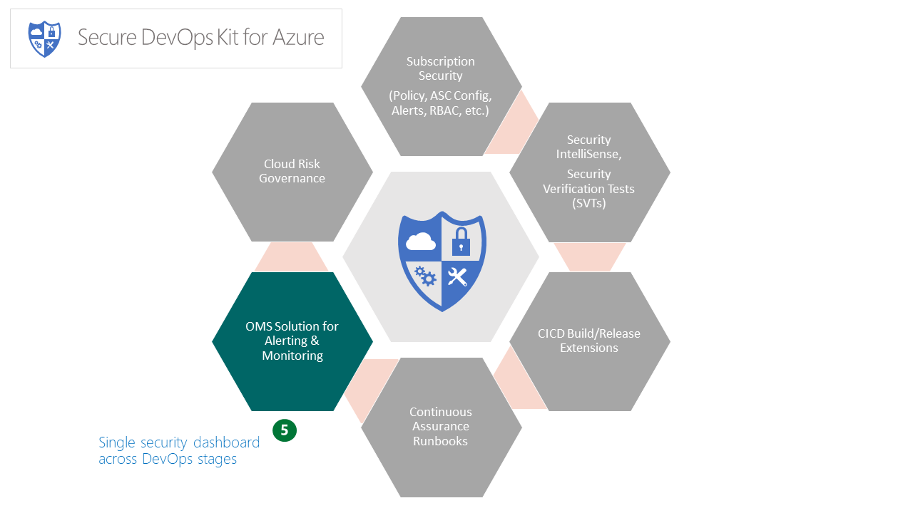

# Alerting & Monitoring (AM)

> This page provides a gist of the feature area and capabilities delivered by the features. For more details, please refer [here](Alert_Montoring_userguide.md).

The Alerting & Monitoring package will enhance our current capability of security alerts and monitoring in the following ways 
1. 	 Ability to alert on various actions on PaaS resources. We plan to start with most frequently used and critical services such as storage, SQL, key vault, etc.
2. 	 Consolidation and correlation of events across disparate sources (Azure audit log, Azure Security Center events, AAD logs, OMS logs (also investigating MCAS logs, GumShoe API integration). (Events will be consolidated into the enterprise security events data lake so that, in the future, ML can be used to perform stored analytics. Over time, stream analytics could be used to enhance live decision making.)
3. 	 Application centric view of alerts
4. 	 Enable event flow into enterprise SIEM systems

