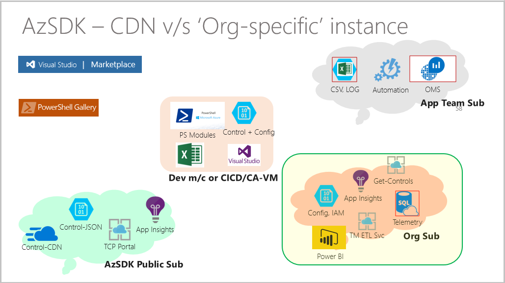
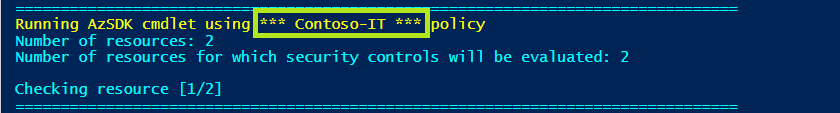
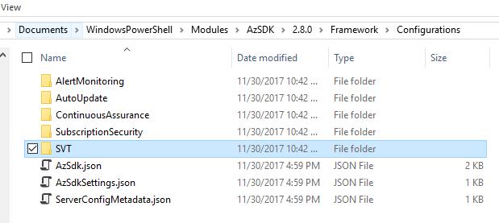
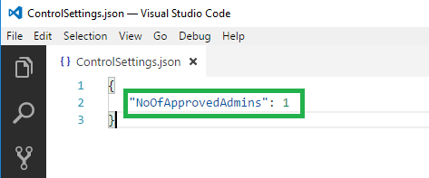
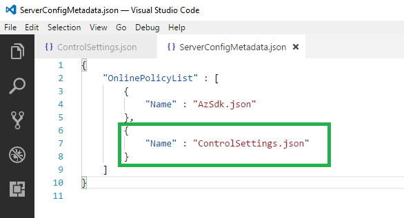
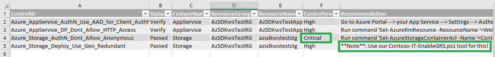

n# Customizing AzSDK for your organization

### [Overview](Readme.md#overview-1)
 - [When and why should I set up Org policy?](Readme.md#when-and-why-should-i-setup-org-policy)
 - [How does AzSDK use online policy?](Readme.md#how-does-azsdk-use-online-policy)

### [Setting up Org policy](Readme.md#setting-up-org-policy-1)
 - [What happens during Org policy setup?](Readme.md#what-happens-during-org-policy-setup)
 - [The Org policy setup command: Install-AzSDKOrganizationPolicy](Readme.md#the-org-policy-setup-command-install-azsdkorganizationpolicy)
 - [First-time policy setup - an example](Readme.md#first-time-policy-setup---an-example)

### [Modifying and customizing Org policy](Readme.md#modifying-and-customizing-org-policy-1)
 - [Common scenarios for org policy customization](Readme.md#common-scenarios-for-org-policy-customization)  
 - [Next Steps](Readme.md#next-steps)


### [Testing and Troubleshooting Org Policy](Readme.md#testing-and-troubleshooting-org-policy-1)
 - [Testing the overall policy setup](Readme.md#testing-the-overall-policy-setup)
 - [Troubleshooting common issues](Readme.md#troubleshooting-common-issues)
 

----------------------------------------------------------------

## Overview

#### When and why should I setup Org policy

When you run any scan command from the AzSDK, it relies on JSON-based 'policy' files to determine various 
parameters about the requested security scan. These policy files are downloaded 'on the fly' from a policy 
server. When you run the public version of the toolkit, the policy files are accessed from a CDN endpoint 
that is owned by the AzSDK team. Thus, whenever you run a scan, the AzSDK code accesses the CDN endpoint 
to get the latest policy configuration and runs the scan using it. 

The JSON inside the policy files dictate the behavior of the security scan. 
This includes things such as:
 - Which set of controls to evaluate?
 - What control set to use as a baseline?
 - What settings/values to use for individual controls? 
 - What messages to display for recommendation? 
 - etc.


Note that the policy files needed for security scans are downloaded live for all AzSDK scenarios. That is, 
apart from manually run scans from your desktop, this same behavior happens if you include the AzSDK CICD 
Release task in your CICD pipeline or if you setup Continuous Assurance. Also, the AzSDK policy files on the 
CDN are based on what we use internally in Core Services Engineering (CSE) at Microsoft. We also keep 
them up to date from one release to next .

 

 While the out-of-box files on CDN may be good for limited use, in many contexts you may want to "customize" 
the behavior of the security scans for your environment. You may want to do things such as: (a) enable/disable 
some controls, (b) changes control settings to better match specific security policies in your organization, 
(c) change various messages, (d) add additional filter criteria for certain regulatory requirements that teams 
in your organization can leverage, etc. When faced with such a need, you need a way to create and managed 
a policy endpoint for your own environment. The organization policy setup feature helps you do that in 
an automated fashion. 

In this document, we will look at how to setup an organization-specific policy endpoint, how to make changes 
to and manage the policy files and how to accomplish various common org-specific policy/behavior customizations 
for the AzSDK.

#### How does AzSDK use online policy?

Let us look at how policy files are leveraged in a little more detail. 
When you install AzSDK, it downloads the latest module and an *offline* set of policy files in a sub-folder 
under the %userprofile%\documents\WindowsPowerShell\Modules\AzSDK\<version> folder. It also places (or updates) 
an AzSDKSettings.JSON file in your %LocalAppData%\AzSDK folder. It is this latter file that contains the policy 
endpoint (or policy server) URL that is used by all local commands. 

Whenever any command is run, AzSDK uses the policy server URL to access the policy endpoint. It first downloads 
a 'metadata' file that contains information about other files available on the policy server. After that, to 
actually perform a scan, it fetches the local copy of a policy file and 'overlays' any settings if the corresponding 
file was also found on the server-side. 

<!-- **TODO** <PIC - Gagan can you make something rough for the as-is/CDN scenario? Even a flow chart is fine.>-->

It then accesses the policy to download a 'metadata' file that helps it determine the actual policy files list 
that is present on the server. Thereafter, the scan runs by overlaying the settings obtained from the server with 
the ones that are available in the local installation module folder. This means that if there hasn't been anything 
overridden for a specific feature (e.g., Storage), then it won't find a policy file for that listed in the server
 metadata file and the local policy file for that feature will get used. 

## Setting up Org policy

#### What happens during Org policy setup?

At a high level, the org policy setup support for AzSDK does the following:
 - Sets up a storage account to hold various policy artifacts in the subscription you want to use for hosting 
your policy endpoint. (This should be a secure, limited-access subscription used only for managing your org's AzSDK policy.)
 - Uploads the minimum set of policy files required to bootstrap your policy server.
 - Sets up an Application Insights telemetry account in the subscription so as to facilitate visibility of control 
scan/telemetry events in your central subscription. (This is where control pass/fail events will get sent when other 
people in the org start running the AzSDK after you've customized it for your org policy.)
 - Creates a special folder (or uses one specified by you) for storing a local copy of all customizations made to policy.
 - Creates an org-specific (customized) installer that others in your org will use to install and configure the AzSDK 
per your org's policy.

Let us now look at the command that will help with the above and a few examples…

#### The Org policy setup command (`Install-AzSDKOrganizationPolicy`)

This command helps a central security team of an organization to customize the AzSDK behaviour.  

AzSDK is mainly controlled through policy files having predefined schema. The command helps in creating a policy store 
and other required components. 

| Parameter| Description | Required? | Default Value | Comments |
| ---- | ---- | ---- |----|---- |
| SubscriptionId | Subscription ID of the Azure subscription in which organization policy  store will be created | Yes | None | 
|OrgName | The name of your organization. The value will be used to evaluate names of Azure resources being created as part of policy set up. Should be alphanumeric. | Yes | None |
| DepartmentName | The name of department in your organization.  The value will be used to evaluate names of Azure resources being created as part of policy set up. Should be alphanumeric. | No | None |
| PolicyFolderPath | The folder in which the policy files will be stored for reference. The location can be used to manage policy files. | No | User Desktop |
| ResourceGroupLocation | The location in which the Azure resource will be created | No | EastUS2 | To obtain valid locations, use Get-AzureRMLocation cmdlet |

#### First-time policy setup - an example
The following example will set up policies for IT department of Contoso organization. 

```PowerShell
Install-AzSDKOrganizationPolicy -SubscriptionId <SubscriptionId> ` 
           -OrgName "Contoso" ` 
           -DepartmentName "IT" ` 
           -PolicyFolderPath "D:\ContosoPolicies"
```
The execution of command will create following resources, if not exists: 
1. Resource Group (AzSDK-Contoso-IT-RG) - AzSDK-<OrgName>-<DepartmentName>-RG. 
2. Storage Account (azsdkcontosoitsa) - azsdk<OrgName><DepartmentName>sa.
3. Application Insight (AzSDK-Contoso-IT-AppInsight) - AzSDK-<OrgName>-<DepartmentName>-AppInsight. 

At the end of execution, a command to install Org-specific version of AzSDK will be provided. Run the iwr to 
install the customized version of AzSDK.  

```PowerShell
iwr 'https://azsdkcontosoitsa.blob.core.windows.net/installer/AzSDK-EasyInstaller.ps1' -UseBasicParsing | iex 
```


## Modifying and customizing Org policy 

All subsequent runs of the (same) command above will pick up the JSON files from local PolicyFolderPath and upload 
to policy store, provided the values for OrgName and DepartmentName are unchanged.

> **Note**: ServerConfigMetadata.json and AzSDK-EasyInstaller.ps1 will always get overwritten on the subsequent run of the command. 

	
#### Common scenarios for org policy customization

In this section let us look at typical use cases for org policy customization and how to accomplish them. 
We will cover the following:
 a) Changing the default 'Running AzSDK using…' message  
 b) Changing a global setting for some control
 c) Changing/customizing a server baseline policy set
 d) Customizing specific controls for a service 
	i) Turning On/Off
	ii) Changing Recommendation Text
	iii) Etc.
 e) Changing ARM policy/Alerts set (coming soon…)
 f) Changing RBAC mandatory/deprecated lists (coming soon…)


> Note: To edit policy JSON files, use a friendly JSON editor such as Visual Studio Code. It will save you lot of
> debugging time by telling you when objects are not well-formed (extra commas, missing curly-braces, etc.)!

The general workflow for all policy changes will be similar and involve the following steps:

 1) Go to the folder you have used (or the org-setup command auto-generated) for your org-customized policies
 2) Make any modifications to existing files (or add additional policy files as required)
 3) Make sure that there's an entry in the ServerConfigMetadata.json file for all the files you have modified
 4) Run the policy update command to upload all artifacts to the policy server
 5) Test in a fresh PS console that the policy change is in effect. 

Note that you can upload policy files from any folder (e.g., a clone of the originally used/created one). It just needs to 
have the same folder structure as the default. 

Secondly, because policy on the server works using the 'overlay' approach, the corresponding file on the server
only needs to have the specific changes that are required (plus some identifying elements in some cases).

More importantly, when making modifications, we will **never** edit the files that came with the AzSDK installation. 
We will create copies of the files we wish to edit and place them in the org-policy folder and make requisite
modifications there.

##### a) Changing the default `'Running AzSDK using...'` message
Whenever any user in your org runs an AzSDK command after having installed AzSDK using your org-specific installer, 
they should see a message such as the following indicating that AzSDK is running using an org-specific policy:

    Running AzSDK cmdlet using Contoso-IT policy

Notice that here, the default (first time) org policy setup injects the 'Contoso-IT' based on the OrgName and
the DeptName that you provided when you setup your org policy server. (When users are running without your org policy correctly setup, they will see the 'Running AzSDK cmdlet using generic (org-neutral)
policy' message which comes from the AzSDK public CDN endpoint.)

This message resides in the policy AzSdk.json policy file on the server and the AzSDK always displays the text 
from the file after downloading it from the server.

You may want to change this message to something more detailed. (Or even use this as a mechanism to notify all users
within the org about something related to AzSDK that they need to attend to immediately.) 
In this example let us just make a simple change to this message. We will just add '*' characters on either side 
of the 'Contoso-IT' so it stands out a bit.

Steps:

 i) Open the AzSdk.json from your local org-policy folder
 ii) Edit the value for "Policy Message" field by adding 3 '*' characters on each side of 'Contoso-IT' as under:
```
    "PolicyMessage" : "Running AzSDK cmdlet using *** Contoso-IT *** policy"
```
 iii) Save the file
 iv) Run the policy setup command (the same command you ran for the first time setup)

The updated policy is now on the policy server. You can ask any other person to test by running any AzSDK cmdlet
(e.g., Get-AzSDKInfo) in a **fresh** PS console. When the command starts, it will show an updated message as in the 
image below:

 

This change will be immediately in effect across your organization. Anyone running AzSDK commands (in fresh PS sessions)
should see the new message. 

##### b) Changing a control setting for specific controls 
Let us now change some numeric setting for a control. A typical setting you may want to tweak is the count of
maximum owners/admins for your org's subscriptions. (The out-of-box default is 5.)

This setting resides in a file called ControlSettings.json. The local version of this file should be in the following
folder:
```PowerShell
    %userprofile%\Documents\WindowsPowerShell\Modules\AzSDK\<version>\Framework\Configurations
```

    
 
This folder holds all policy files for AzSDK. We will make copies of files we need to change from here and place
the changed versions in the org-policy folder. Note that you should **never** edit any file directly in the local
AzSDK policy folder. Rather, copy the file to the org-policy folder and edit it there.

Steps:

 i) Copy the ControlSettings.json from the AzSDK installation to your org-policy folder
 ii) Remove everything except the "NoOfApprovedAdmins" line while keeping the JSON object hierarchy intact
     

 iii) Save the file
 iv) Edit the ServerConfigMetadata.json file in the org-policy folder and create an entry for this file (if not already there)
     
```JSON
{
    "OnlinePolicyList" : [
        {
            "Name" : "AzSdk.json"
        }, 
        {
            "Name" : "ControlSettings.json"
        }
    ]
}
```
 v) Run the policy setup command (the same command you ran for the first time setup)
 
Testing: 

Anyone in your org can now start a fresh PS console and evaluation of the number of owners/admins control in 
the subscription security scan (Get-AzSDKSubscriptionSecurityStatus) should reflect that the new setting is in effect.

##### c) Creating a custom control 'baseline' for your org
Note that a powerful capability of AzSDK is the ability for an org to define a baseline control set on the policy server
that can be leveraged by all individuals in the org (and other AzSDK scenarios) via the "-UseBaselineControls" parameter
during scan commands. 

By default, when someone runs against the CDN endpoint, the "-UseBaselineControls" parameter leverages the set of
controls listed as baseline in the ControlSettings.json file present on CDN. 

However, once you have set up and org policy server for your organization, the CDN endpoint is no more in use. (As a 
side note, you can always 'simulate' CDN-based execution by removing or renaming your 
`%localappdata%\Microsoft\AzSDK\AzSDKSettings.json` file.) Thus, after org policy is setup, there will 
not be a 'baseline' control set defined for your organization. Indeed, if you run any of the scan commands using the
"-UseBaselineControls" switch, you will see that the switch gets ignored and **all** controls for respective 
resources are evaluated. 

To support the baseline controls behvior for your org, you will need to define your baseline in the ControlSettings.json
file. Here are the steps...

Steps: 
<br>
(We will assume you have done step-b above and edit the ControlSettings.json file directly in your org policy folder.)
 i) Edit the ControlSettings.json file to add a 'BaselineControls' object as per below:
 
```JSON
{
   "NoOfApprovedAdmins": 1,
   "BaselineControls": {
      "ResourceTypeControlIdMappingList": [
         {
            "ResourceType": "AppService",
            "ControlIds": [
               "Azure_AppService_DP_Dont_Allow_HTTP_Access",
               "Azure_AppService_AuthN_Use_AAD_for_Client_AuthN"
            ]
         },
         {
            "ResourceType": "Storage",
            "ControlIds": [
               "Azure_Storage_AuthN_Dont_Allow_Anonymous",
               "Azure_Storage_Deploy_Use_Geo_Redundant"
            ]
         }
      ],
      "SubscriptionControlIdList": [
         "Azure_Subscription_AuthZ_Limit_Admin_Owner_Count",
         "Azure_Subscription_AuthZ_Dont_Use_NonAD_Identities",
         "Azure_Subscription_Config_Azure_Security_Center"
      ],
      "ExpiryInDays": 6,
      "SupportedSources": [ "CC" ]
   }
}
```

> Notice how, apart from the couple of extra elements at the end, the baseline set is pretty much a list of 'ResourceType'
and 'ControlIds' for that resource...making it fairly easy to customize/tweak your own org baseline. Here the name and casing of the resource type name must match that of the policy JSON
file for the corresponding resource's JSON file in the SVT folder and the control ids must match those included in 
the JSON file.
    
 ii) Save the ControlSettings.json file
 iii) Confirm that an entry for ControlSettings.json is already there in the ServerConfigMetadata.json file. (Else see step-iii in (c) above.)
 iv) Run the policy setup command (the same command you ran for the first time setup)

Testing:

To test that baseline controls set is in effect, anyone in your org can start a fresh PS console and run the subscription
and resources security cmdlets with the `-UseBaselineControls` parameter. You will see that regardless of the actual
types of Azure resources present in their subscriptions, only the ones mentioned in the baseline get evaluated in the scan.


##### d) Customizing specific controls for a service 
In this example, we will make a slightly more involved change. Imagine that you want to turn OFF evaluation of some
control altogether (regardless of whether people use the `-UseBaselineControls` parameter or not).
Also, for another control, you want people to use a recommendation which leverages an internal tool the security team
in your org has developed. Let us do this for the Storage.json file. Specifically, we will turn OFF the evaluation
of `Azure_Storage_Audit_Issue_Alert_AuthN_Req` altogether. We will modify severity of 
`Azure_Storage_AuthN_Dont_Allow_Anonymous` to `Critical` for our org (it is `High` by default) and
we will change the recommendation people in our org will follow if they need to address an issue with 
the `Azure_Storage_Deploy_Use_Geo_Redundant` control.

Steps: 
 i) Copy the Storage.json from the AzSDK installation to your org-policy folder
 ii) Remove everything except the ControlID, the Id and the property we want to modify as discussed above. 
 iii) Make changes to the properties of the respective controls so that the final JSON looks like the below. 
```JSON
{
  "Controls": [
   {
      "ControlID": "Azure_Storage_AuthN_Dont_Allow_Anonymous",
      "Id": "AzureStorage110",
      "ControlSeverity": "Critical"
   },
   {
      "ControlID": "Azure_Storage_Audit_Issue_Alert_AuthN_Req",
      "Id": "AzureStorage120",
      "Enabled": false
   },
   {
      "ControlID": "Azure_Storage_Deploy_Use_Geo_Redundant",
      "Id": "AzureStorage130",
      "Recommendation": "**Note**: Use our Contoso-IT-EnableGRS.ps1 tool for this!"
   }
  ]
}
```
 iii) Save the file
 iv) Edit the ServerConfigMetadata.json file in the org-policy folder and create an entry for this file (if not already there)
 It should look something like the below:
```JSON
{
    "OnlinePolicyList" : [
        {
            "Name" : "AzSdk.json"
        }, 
        {
            "Name" : "ControlSettings.json"
        }, 
        {
            "Name" : "Storage.json"
        }
    ]
}
```  
 v) Run the policy setup command (the same command you ran for the first time setup)
 
Testing: 
Someone in your org can test this change using the `Get-AzSDKAzureServicesSecurityStatus` command on a target
resource group which contains a storage account. If run with the `-UseBaselineControls` switch, you will see that
the anonymous access control shows as `Critical` in the output CSV and the GRS control recommendation has changed to
the custom (internal tool) recommendation you want people in your org to follow. The image below shows the CSV file
from a baseline scan after this change: 

 

Likewise, if you run without the `-UseBaselineControls` parameter, you will see that the anon-alert control does not get evaluated and does not
appear in the resulting CSV file. 


## Next Steps:

Once your org policy is setup, most other scenarios/use cases of AzSDK should work seamlessly with your org policy server
as the policy endpoint for your org. Basically, you should be able to do one or more of the following using AzSDK:

 - People will be able to install AzSDK using your special org-specific installer (iwr command)
 - Developers will be able to run manual scans for security of their subscriptions and resources (GRS, GSS commands)
 - (Coming soon) Teams will be able to configure the AzSDK CICD SVT release task in their CICD pipelines
 - Subscription owners will be able to setup Continuous Assurance (CA) from their local machines (assuming they've installed
 AzSDK using your org-specific 'iwr' installer locally first)
 - Monitoring teams will be able to setup AzSDK OMS view and see scan results from CA (and also manual scans and CICD if configured) 
 - You will be able to do central governance for your org by leveraging the telemetry events that are collecting in the master subscription	 

## Testing and troubleshooting Org policy
#### Testing the overall policy setup
The policy setup command is fairly lightweight - both in terms of effort/time and in terms of costs incurred. We recommend that
you setup a 'Staging' environment where you can do all pre-testing of policy setup, policy changes, etc. A limited number of 
people could be engaged for testing the actual end user effects of changes as well. Also, you can retain the staging setup or
re-create it for each major policy change.

For your actual (production) policies, we recommend that you check them into source control and use *that* folder as the location
for the AzSDK org policy setup command when uploading to the policy server. In fact, setting things up so that any policy
modifications are pushed to the policy server via a CICD pipeline would be idea. (That is how we do it at CSE.)

	
#### Troubleshooting common issues 
Here are a few common things that may cause glitches and you should be careful about:

- Make sure you use exact case for file names for various policy files (and the names must match case-and-all
with the entries in the ServerConfigMetadata.json file)
- Make sure that no special/BOM characters get introduced into the policy file text. (The policy upload code does scrub for
a few known cases but we may have missed the odd one.)
- Don't forget to make entries in ServerConfigMetadata.json for all files you have changed.
- Note that the policy upload command always generates a fresh installer.ps1 file for upload. If you want to make changes to 
that, you may have to keep a separate copy and upload it. (We will revisit this in future sprints.)
