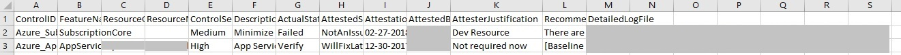

# Advanced features
### Contents
### [Fetch information about various AzSDK components](Readme.md#fetch-information-about-various-azsdk-components)

- [Overview](Readme.md#overview)
- [Basic information](Readme.md#basic-information)
- [Control information](Readme.md#control-information)
- [Attestation information](Readme.md#attestation-information)
- [Environment information](Readme.md#environment-information)

### Overview

This command provides overall information about the AzSDK which includes basic information (module version, policies version etc.), security controls information (severity, description, rationale etc.), attestation information (statistics, attetstation justification, expiry etc.), environment information (subscription details etc.). 'Get-AzSDKInfo' command can be used with 'InfoType' parameter to fetch information.

### Basic information

Run below command to get information about,
- Version of currently installed AzSDK module 
- Latest available baseline configuration for different features (ARM Policies, Alerts, ASC, Access control) 
- Baseline configuration setup in user's subscription 

```PowerShell
	Get-AzSDKInfo -InfoType 'BasicInfo' 
```
Below is the sample output: 

  

[Back to top…](Readme.md#contents)
### Control information 

Run below command to get information about Azure services security control(s) i.e.
- Feature Name
- ControlID
- Description
- ControlSeverity
- Rationale
- Recommendation
- Tags

```PowerShell
	Get-AzSDKInfo -InfoType 'ControlInfo' `
                [-ResourceTypeName <ResourceTypeName>] `
                [-ControlIds <ControlIds>] `
                [-UseBaselineControls] `
                [-FilterTags] `
```

|Param Name|Purpose|Required?|Default value|
|----|----|----|----|
|ResourceTypeName|Friendly name of resource type. Run command 'Get-AzSDKSupportedResourceTypes' to get the list of supported values. E.g. AppService, KeyVault|FALSE|All|
|ControlIds|Comma-separated list of Control Ids|FALSE|None|
|UseBaselineControls|The flag used to get details of controls defined in baseline|FALSE|None|
|FilterTags|Comma-seperated tags to filter the security controls. E.g., RBAC, AuthN, etc.|FALSE|None|


Below is the sample output:

  
[Back to top…](Readme.md#contents)

### Attestation information

Run below command to get information about attested security control(s) in user's subscription i.e. Attestation status, attested by, attestation date, atestation expiry date, justification, attested data. It also provides different attestation statistics which includes distribution of attested controls by actual scan result (Failed/Verify), ControlId, Control severity, Expiry date (next 30 days).

```PowerShell
	Get-AzSDKInfo -InfoType 'AttestationInfo' `
		-SubscriptionId <SubscriptionId> `
                [-ResourceTypeName <ResourceTypeName>] `
		[-ResourceGroupNames <ResourceGroupNames>] `
		[-ResourceNames <ResourceNames>] `
                [-ControlIds <ControlIds>] `
		[-UseBaselineControls] 
```

|Param Name|Purpose|Required?|Default value|
|----|----|----|----|
|SubscriptionId|Subscription ID is the identifier of your Azure subscription|TRUE|   |  
|ResourceTypeName|Friendly name of resource type. Run command 'Get-AzSDKSupportedResourceTypes' to get the list of supported values. E.g. AppService, KeyVault|FALSE|All|   
|ResourceGroupNames|Comma-separated list of resource groups that hold related resources for an Azure subscription|FALSE|   |  
|ResourceNames|Comma-separated list of the name of the resources|FALSE|   |
|ControlIds|Comma-separated list of Control Ids|FALSE|None|
|UseBaselineControls|The flag used to get attestation details of controls defined in baseline|FALSE|None|

Below is the sample output:

* PowerShell console output

 

* Detailed log

 

* CSV report

  
[Back to top…](Readme.md#contents)

### Environment information  

Run below command to get information about,
* Loaded PS modules in PS session
* Logged in user's details
* Azure subscription details

```PowerShell
	Get-AzSDKInfo -InfoType 'EnvironmentInfo'
```

Below is the sample output:

 
